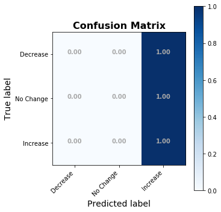
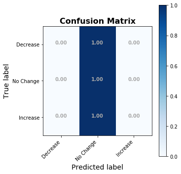
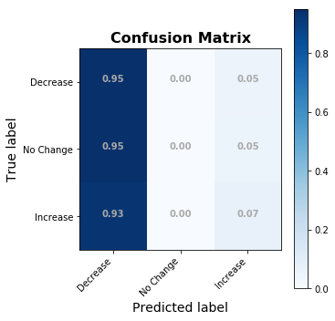
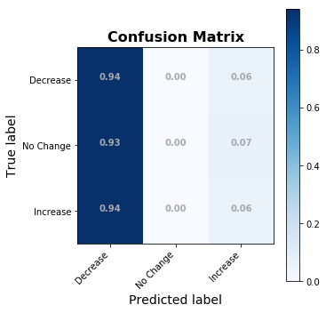
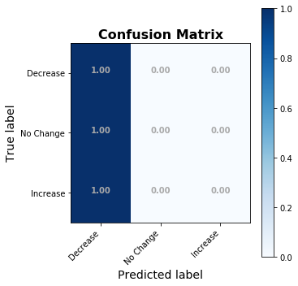
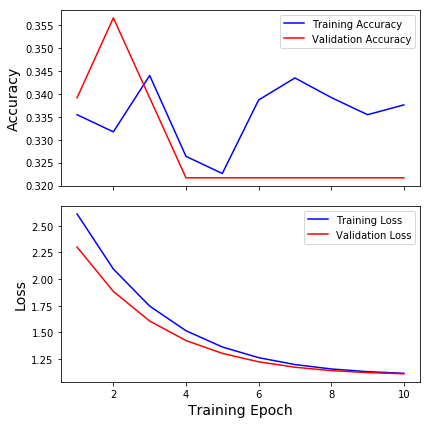
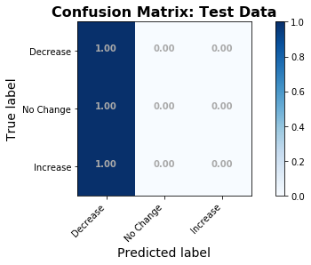

# How to: Hyperparameter Tuning with Keras + Sklearn GridSearchCV
- James M. Irving
- Updated 10/03/2019

<h1>Table of Contents<span class="tocSkip"></span></h1>
<div class="toc"><ul class="toc-item"><li><span><a href="#How-to:-Hyperparameter-Tuning-with-Keras-+-Sklearn-GridSearchCV" data-toc-modified-id="How-to:-Hyperparameter-Tuning-with-Keras-+-Sklearn-GridSearchCV-1">How to: Hyperparameter Tuning with Keras + Sklearn GridSearchCV</a></span><ul class="toc-item"><li><span><a href="#NOTE-/-WARNING:" data-toc-modified-id="NOTE-/-WARNING:-1.1">NOTE / WARNING:</a></span></li><li><span><a href="#HOW-TO:-GridSearch-with-Keras" data-toc-modified-id="HOW-TO:-GridSearch-with-Keras-1.2">HOW TO: GridSearch with Keras</a></span></li><li><span><a href="#HOW-TO:-Custom-Scoring-Functions" data-toc-modified-id="HOW-TO:-Custom-Scoring-Functions-1.3">HOW TO: Custom Scoring Functions</a></span><ul class="toc-item"><li><span><a href="#def-my_custom_scorer" data-toc-modified-id="def-my_custom_scorer-1.3.1">def my_custom_scorer</a></span></li></ul></li></ul></li><li><span><a href="#HOW-TO:-Adding-Email-Notifications-with-Encrypted-Passwords" data-toc-modified-id="HOW-TO:-Adding-Email-Notifications-with-Encrypted-Passwords-2">HOW TO: Adding Email Notifications with Encrypted Passwords</a></span><ul class="toc-item"><li><ul class="toc-item"><li><span><a href="#def-email_notification" data-toc-modified-id="def-email_notification-2.0.1">def email_notification</a></span></li></ul></li></ul></li><li><span><a href="#EXAMPLE-USAGE" data-toc-modified-id="EXAMPLE-USAGE-3">EXAMPLE USAGE</a></span><ul class="toc-item"><li><span><a href="#Load-data" data-toc-modified-id="Load-data-3.1">Load data</a></span></li><li><span><a href="#Tokenize-and-train/test/val-split" data-toc-modified-id="Tokenize-and-train/test/val-split-3.2">Tokenize and train/test/val split</a></span></li><li><span><a href="#EXAMPLE---USING-GRIDSEARCH-DIRECTLY" data-toc-modified-id="EXAMPLE---USING-GRIDSEARCH-DIRECTLY-3.3">EXAMPLE - USING GRIDSEARCH DIRECTLY</a></span></li><li><span><a href="#EXAMPLE-USAGE-AS-A-FUNCTION" data-toc-modified-id="EXAMPLE-USAGE-AS-A-FUNCTION-3.4">EXAMPLE USAGE AS A FUNCTION</a></span></li><li><span><a href="#Companion/Follow-up-Function-for-Running-Best-Params-from-fit_gridsearch" data-toc-modified-id="Companion/Follow-up-Function-for-Running-Best-Params-from-fit_gridsearch-3.5">Companion/Follow-up Function for Running Best Params from <code>fit_gridsearch</code></a></span></li></ul></li></ul></div>

## NOTE / WARNING:
> **I use my custom package `bs_ds` in this notebook.** <br><br>
> bs_ds installs **Cufflinks with Plotly** to make ***super easy*** Plotly figures.<br>
`>> df.iplot(kind='bar')`

> But this means it **requires the OLDER v3** of PLotly (V3.10) <br>
> ***[!] If you install bs_ds it may overwrite your Plotly v4.***<br>
- You can simply run`!pip install -U plotly` again to restore it.

> **P.S. Cufflinks is TOTALLY worth it**, if you aren't reliant on Plotly v4.
- To Learn About Cufflinks:
    - http://web.quant-platform.com/trial/yves/Plotly_Cufflinks.html
- To use cufflinks:<br>
`import cufflinks as cf
cf.go_offline()
` 
- Thats it! Now there is a new `.iplot()` method on pandas dataframes.


**`Uncomment the cell below to install/update bs_ds`**


```python
## Uncomment to install / update bs_ds. (read note below first)
#!pip install -U bs_ds
```


```python
## IMPORT CUSTOM CAPSTONE FUNCTIONS
import functions_combined_BEST as ji
from functions_combined_BEST import ihelp, ihelp_menu,\
reload, inspect_variables

import warnings
warnings.filterwarnings('ignore')
## IMPORT MY PUBLISHED PYPI PACKAGE 
from bs_ds.imports import *
```

    bs_ds  v0.9.12 loaded.  Read the docs: https://bs-ds.readthedocs.io/en/latest/index.html
    For convenient loading of standard modules use: from bs_ds.imports import *
    
    


<style  type="text/css" >
</style><table id="T_9fa1967a_e645_11e9_a6e5_f48e38b6371f" ><caption>Loaded Packages and Handles</caption><thead>    <tr>        <th class="col_heading level0 col0" >Package</th>        <th class="col_heading level0 col1" >Handle</th>        <th class="col_heading level0 col2" >Description</th>    </tr></thead><tbody>
                <tr>
                                <td id="T_9fa1967a_e645_11e9_a6e5_f48e38b6371frow0_col0" class="data row0 col0" >bs_ds</td>
                        <td id="T_9fa1967a_e645_11e9_a6e5_f48e38b6371frow0_col1" class="data row0 col1" >bs</td>
                        <td id="T_9fa1967a_e645_11e9_a6e5_f48e38b6371frow0_col2" class="data row0 col2" >Custom data science bootcamp student package</td>
            </tr>
            <tr>
                                <td id="T_9fa1967a_e645_11e9_a6e5_f48e38b6371frow1_col0" class="data row1 col0" >matplotlib</td>
                        <td id="T_9fa1967a_e645_11e9_a6e5_f48e38b6371frow1_col1" class="data row1 col1" >mpl</td>
                        <td id="T_9fa1967a_e645_11e9_a6e5_f48e38b6371frow1_col2" class="data row1 col2" >Matplotlib's base OOP module with formatting artists</td>
            </tr>
            <tr>
                                <td id="T_9fa1967a_e645_11e9_a6e5_f48e38b6371frow2_col0" class="data row2 col0" >matplotlib.pyplot</td>
                        <td id="T_9fa1967a_e645_11e9_a6e5_f48e38b6371frow2_col1" class="data row2 col1" >plt</td>
                        <td id="T_9fa1967a_e645_11e9_a6e5_f48e38b6371frow2_col2" class="data row2 col2" >Matplotlib's matlab-like plotting module</td>
            </tr>
            <tr>
                                <td id="T_9fa1967a_e645_11e9_a6e5_f48e38b6371frow3_col0" class="data row3 col0" >numpy</td>
                        <td id="T_9fa1967a_e645_11e9_a6e5_f48e38b6371frow3_col1" class="data row3 col1" >np</td>
                        <td id="T_9fa1967a_e645_11e9_a6e5_f48e38b6371frow3_col2" class="data row3 col2" >scientific computing with Python</td>
            </tr>
            <tr>
                                <td id="T_9fa1967a_e645_11e9_a6e5_f48e38b6371frow4_col0" class="data row4 col0" >pandas</td>
                        <td id="T_9fa1967a_e645_11e9_a6e5_f48e38b6371frow4_col1" class="data row4 col1" >pd</td>
                        <td id="T_9fa1967a_e645_11e9_a6e5_f48e38b6371frow4_col2" class="data row4 col2" >High performance data structures and tools</td>
            </tr>
            <tr>
                                <td id="T_9fa1967a_e645_11e9_a6e5_f48e38b6371frow5_col0" class="data row5 col0" >seaborn</td>
                        <td id="T_9fa1967a_e645_11e9_a6e5_f48e38b6371frow5_col1" class="data row5 col1" >sns</td>
                        <td id="T_9fa1967a_e645_11e9_a6e5_f48e38b6371frow5_col2" class="data row5 col2" >High-level data visualization library based on matplotlib</td>
            </tr>
    </tbody></table>


## HOW TO: GridSearch with Keras


Original Source: https://chrisalbon.com/deep_learning/keras/tuning_neural_network_hyperparameters/
<br><br>

- To use `GridSearchCV` or other similar functions in scikit-learn with a Keras neural network, we need to wrap our keras model in `keras.wrappers.scikit_learn`'s `KerasClassifier` and `KerasRegressor`.
1. To do this, we need to write a build function(`build_fn`) that creates our model such as `create_model`.
    - This function must accept whatever parameters you wish to tune. 
    - It also must have a default argument for each parameter.
    - This function must Return the model (and only the model)
    
```python

## Define the build function
def create_model(n_units=(50,25,7), activation='relu',final_activation='softmax',
                optimizer='adam'):
    
    ## Pro tip:save the local variables now so you can print out the parameters used to create the model.
    params_used = locals()
    print('Parameters for model:\n',params_used)
    
   
    from keras.models import Sequential
    from keras import layers
    
    model=Sequential()
    model.add(layers.Dense(n_units[0], activation=activation, input_shape=(2000,)))
    model.add(layers.Dense(n_units[1], activation=activation))
    model.add(layers.Dense(n_units[2], activation=final_activation))
    model.compile(optimizer=optimizer, loss='categorical_crossentropy',metrics=['accuracy'])
    
    display(model.summary())
    return model 
```    

2. We then create out model using the Keras wrapper:

```python
from keras.wrappers.scikit_learn import KerasClassifier
neural_network =  KerasClassifier(build_fn=create_model,verbose=1)
```

3. Now, set up the hyperparameter space for grid search. (Remember, your `create_model` function must accept the parameter you want to tune)

```python
params_to_test = {'n_units':[(50,25,7),(100,50,7)],
                  'optimizer':['adam','rmsprop','adadelta'],
                  'activation':['linear','relu','tanh'],
                  'final_activation':['softmax']}
```

4. Now instantiate your GridSearch function

```python
from sklearn.model_selection import GridSearchCV

grid = GridSearchCV(estimator=neural_network,param_grid=params_to_test)
grid_result = grid.fit(X_train, y_train)
best_params = grid_result.best_params_
```
5. And thats it!


## HOW TO: Custom Scoring Functions

1. **Why would you do this?**
    1. You may want to use a metric that isn't available in sklearn. 
        - In the included `my_custom_scorer` function, I take the accuracy of each class's predictions from the diagonal of a normalized confusion matrix. 
        - I then calculate the mean of those 3 class accuracies, which is the `score` that is returned to the gridsearch. 
        
    2. You may want to add a printout or display to the scoring function so you can see the results as the search is going.
<br><br>
2. **How do you do write your own?**
    1. Define your custom scoring function.
        - It must accept `y_true`,`y_pred`
        - It must return a value to maximize. (like accuracy)
    2. You can add print or display commands to have the scoring function report the current results as the gridsearch is still going.
        - If you combine this with the example `create_model` function above that includes the `vars=locals(); print(vars)` command, then gridsearch will display:
            1. the parameters of each model (each time the `create_model` function is called.
            2. The score of each model, including a confusion matrix figure (each time it calls `my_custom_scorer`).
        
```python
def my_custom_scorer(y_true,y_pred):
    """My custom score function to use with sklearn's GridSearchCV
    Maximizes the average accuracy per class using a normalized confusion matrix"""
    from sklearn.metrics import confusion_matrix
    import numpy as np
    import functions_combined_BEST as ji    

    ## Flatten one-hot encoded target columns into 1 column for sklearn functions
    if y_true.ndim>1 or y_pred.ndim>1:
        
        ## reduce dimensions of y_train and y_test
        if y_true.ndim>1:            
            y_true = y_true.argmax(axis=1)
        
        if y_pred.ndim>1:
            y_pred = y_pred.argmax(axis=1)

    
     # Get confusion matrx
    cm = confusion_matrix(y_true, y_pred)

    # Normalize confusion matrix
    cm_norm = cm.astype('float')/cm.sum(axis=1)[:,np.newaxis]

    ## Get diagonals for class accuracy
    diag = cm_norm.diagonal()
    
    # Get the mean of the diagonal values
    score = np.mean(diag)
    
    ## Display Results for the User
    print(f'Mean Class Accuracy = {score}')
    print(f'Class Accuracy Values:')
    print(diag)    

    ## Plot the confusion matrix.
    ji.plot_confusion_matrix(cm,normalize=True)

    # return the score 
    return score
```        
        
        
3. **How do you use it?**
    - When instantiating GridSearchCV pass your function as the `scoring=` parameter, wrapped in the  `sklearn.metrics.make_scorer` function.
  

```python
## Using custom scoring function
from sklearn.metrics import make_scorer

grid = GridSearchCV(estimator=neural_network, 
                    param_grid=params_to_test,
                   scoring=make_scorer(my_custom_scorer))
                    
grid_result = grid.fit(X_train, y_train)
```

### def my_custom_scorer


```python
def my_custom_scorer(y_true,y_pred):
    """My custom score function to use with sklearn's GridSearchCV
    Maximizes the average accuracy per class using a normalized confusion matrix
    [i] Note: To use my_custom_scorer in GridSearch:
    >> from sklearn.metrics import make_scorer
    >> grid = GridSearch(estimator, parameter_grid)
    """
    from sklearn.metrics import make_scorer,confusion_matrix
    import numpy as np
    import functions_combined_BEST as ji    

    # set labels for confusion matrix
    labels = ['Decrease','No Change', 'Increase']

    
    ## If y_true is a multi-column one-hotted target
    if y_true.ndim>1 or y_pred.ndim>1:

        ## reduce dimensions of y_train and y_test
        if y_true.ndim>1:            
            y_true = y_true.argmax(axis=1)
            
        if y_pred.ndim>1:
            y_pred = y_pred.argmax(axis=1)

    
    ## Get confusion matrx
    cm = confusion_matrix(y_true, y_pred)

    ## Normalize confusion matrix
    cm_norm = cm.astype('float')/cm.sum(axis=1)[:,np.newaxis]

    ## Get diagonals for class accuracy
    diag = cm_norm.diagonal()
    score = np.mean(diag)
    
    
    ## Display results for user
    print(f'Mean Class Accuracy = {score}')
    print(f'Class Accuracy Values:')
    print(diag)    

    ## Plot confusion matrix
    ji.plot_confusion_matrix(cm,normalize=True,classes=labels);

    return score
```


```python
ji.ihelp_menu2([ji.plot_confusion_matrix])
```


    GridBox(box_style='warning', children=(VBox(children=(Label(value='iHelp Menu: View Help and/or Source Code'),…


    Output()


# HOW TO: Adding Email Notifications with Encrypted Passwords

Original Source/Inspiration: https://www.mssqltips.com/sqlservertip/5173/encrypting-passwords-for-use-with-python-and-sql-server/


```python
class EncryptedPassword():
    """Class that can be used to either provide a password/username to be encrypted 
    OR to load a previously encypted password from file.    
    NOTE: Once you have encrypted your password and saved to bin files, you do not need to provide the password again. 
    Make sure to delete your password from the notebook after. 
    - If encrypting a password, a key file and a password file will be saved to disk. 
        - Default Key Filename: '..\\encryption_key.bin',
        - Default Password Filename: '..\\encrypted_pwd.bin'
        - Default Username Filename: '..\\encrypted_username.bin'
    
    The string representations of the unencrypted password are shielded from displaying, when possible. 
    


    - If opening and decrypting key and password files, pass filenames during initialization. 
    
    
    Example Usage:
    >> # To Encrypt, with default folders:
    >> my_pwd EncryptedPassword('my_password')
    
    >> # To Encrypt With custom folders
    >> my_pwd = EncryptedPassword('my_password',filename_for_key='..\folder_outside_repo\key.bin',
                                    filename_for_password = '..\folder_outside_repo\key.bin')
                                    
                                    
    >> # To open and decrypt files (from default folders):
    >> my_pwd = EncryptedPassword(from_file=True)
    
    >> # To open and decrypt files (from custom folders):
    >> my_pwd = EncryptedPassword(from_file=True, 
                                filename_for_key='..\folder_outside_repo\key.bin',
                                filename_for_password = '..\folder_outside_repo\key.bin')
                                    
        
    """
    
    ## Default username
    username = 'NOT PROVIDED'
    
    ## the .password property is designed so it will not display an unencrypted password. 
    @property ## password getter 
    def password(self):
        # if the encrypyted password already exists, print the encrypted pwd (unusable without key)
        if hasattr(self,'_encrypted_password_'):
            print('Encrypted Password:')
            return self._encrypted_password_
        else:
            raise Exception('Password not yet encrypted.')
    
    ## the .password property cannot be set by a user
    @password.setter ## password setter
    def password(self,password):
        raise Exception('.password is read only.')
        
               
    ## 
    def __init__(self,username=None,password=None,from_file=False, encrypt=True,
                filename_for_key='..\\encryption_key.bin',
                filename_for_password='..\\encrypted_pwd.bin',
                filename_for_username = '..\\encrypted_username.bin'):
        """Accepts either a username and password to encyrypt, 
        or loads a previously encrypyed password from file.
        
        Args:
            username (str): email username.
            password (str): email password (note: if have 2-factor authentication on email account, 
                will need app-specific password).
            from_file (bool): whether to load the user credentials from file
            encrypt (bool): whether to encrypt provided password. Default=True
            
            filename_for_key (str): filepath for key.bin (default is'..\\encryption_key.bin')
            filename_for_password: filepath for password.bin (default is'..\\encryption_pwd.bin')
            filename_for_username: filepath for username.bin (default is'..\\encrypted_username.bin')
            """
        
        ## Save filenames 
        self.filename_for_key = filename_for_key
        self.filename_for_password = filename_for_password
        self.filename_for_username = filename_for_username
        
        ## If user passed a username, set username
        if username is not None:
            self.username = username
        
        ## If no password is provided:
        if (password is None):
            
            ##  if load from file if `from_file`=True
            if (from_file==True):
                
                try: ## Load in the key, password, username files
                    self.load_from_file(key_filename=filename_for_key,
                                    password_filename=filename_for_password,
                                        username_filename=filename_for_username)
                except:
                    raise Exception('Something went wrong. Do the key and password files exist?')
            
            ## If no password provided, and from_file=False, raise error
            else:
                raise Exception('Must either provide a password to encrypt, or set from_file=True')
        
        
        ## If the user DOES provide a password
        else:
            self._password_ = password # set the private attribute for password
            
            ## Encrypt the password
            if encrypt:
                self.encrypt_password()
                
                
    def encrypt_password(self, show_encrypted_password=False):
        """Encrypt the key, username, and password and save to external files."""
         ## Get filenames to use.
        filename_for_key= self.filename_for_key
        filename_for_password=self.filename_for_password
        filename_for_username = self.filename_for_username

        ## Import cryptography and generate encryption key
        from cryptography.fernet import Fernet
        key = Fernet.generate_key()
        self._key_ = key

        ## Create the cipher_suit from key for encrypting/decrypting
        cipher_suite = Fernet(key)
        self._cipher_suite_ = cipher_suite
 
        ## ENCRYPT PASSWORD
        # Get password and change to byte encoding
        password = self._password_
        password_to_encrypt = bytes(password,'utf-8') #password must be in bytes format
        
        # Use the encryption suite to encrypt the password and save to self
        ciphered_pwd = cipher_suite.encrypt(password_to_encrypt)
        self._encrypted_password_ = bytes(ciphered_pwd).decode('utf-8')
        
        # Print encrypyted password if true
        if show_encrypted_password:
            print('Encrypyted Password:')
            print(self._encrypted_password_)
        
        
        ## ENCRYPT USERNAME
        username = self.username
        username_to_encrypt = bytes(username,'utf-8')
        ciphered_username = cipher_suite.encrypt(username_to_encrypt)
        self._encrypted_username_ = bytes(ciphered_username).decode('utf-8')
        
        ## TEST DECRYPTION
        # decrypt password and username
        unciphered_pwd = cipher_suite.decrypt(ciphered_pwd)
        unciphered_username = cipher_suite.decrypt(ciphered_username)
        
        ## Decode from bytes to utf-8
        password_decoded = unciphered_pwd.decode('utf-8')
        username_decoded = unciphered_username.decode('utf-8')
        
        # Check if decoded text matches input text
        check_pwd = password_decoded==password
        check_user = username_decoded==username
        
        ## If everything matches, warn user to delete their exposed password
        if  check_pwd & check_user:
            self._password_ = password_decoded 
            print('[!] Make sure to delete typed password above from class instantiation.')
        else:
            raise Exception('Decrypted password and input password/username do not match. Something went wrong.')

        ## SAVE KEY, PASSWORD, AND USERNAME TO BIN FILES
        ## Specify binary files (outside of repo) for storing key and password files
        with open(filename_for_key,'wb') as file:
            file.write(key)

        with open(filename_for_password,'wb') as file:
            file.write(ciphered_pwd)
            
        with open(filename_for_username,'wb') as file:
            file.write(ciphered_username)

        # Display filepaths for user.
        print(f'[io] Encryption Key saved as {filename_for_key}')
        print(f'[io] Encrypted Password saved as {filename_for_password}')
        print(f'[io] Encrypted Username saved as {filename_for_username}')

            
    
    def load_from_file(self,key_filename,password_filename,
                      username_filename):
        """Load in the encrypted password from file. """
        
        from cryptography.fernet import Fernet
        
        ## Load Key 
        with open(key_filename,'rb') as file:
            for line in file:
                key = line

        ## Make ciphere suite from key
        cipher_suite = Fernet(key)
        self._cipher_suite_ = cipher_suite

        ## Load password
        with open(password_filename,'rb') as file:
            for line in file:
                encryptedpwd = line
        self._encrypted_password_ = encryptedpwd
        
        ## Decrypt password
        unciphered_text = (cipher_suite.decrypt(encryptedpwd))
        plain_text_encrypted_password = bytes(unciphered_text).decode('utf-8')
        self._password_ = plain_text_encrypted_password
        
        ## Load username
        with open(username_filename,'rb') as file:
            for line in file:
                username = line
        unciphered_username = (cipher_suite.decrypt(username))
        plan_text_username = bytes(unciphered_username).decode('utf-8')
        self.username = plan_text_username
        
    def __repr__(self):
        """Controls the printout when the object is the final command in a cell.
        i.e:
        >> pwd =EncrypytedPassword(username='me',password='secret')
        >> pwd
        """
        password = self._password_
        msg = f'[i] Password is {len(password)} chars long.'
        return msg

    def __str__(self):
        """Controls the printout when the object is printed.
        i.e:
        >> pwd =EncrypytedPassword(username='me',password='secret')
        >> print(pwd)
        """
        password = self._password_
        msg = f'[i] Password is {len(password)} chars long.'
        return msg 
```


```python
## Create EncrypyedPassword object (only need to do this step 1 time from any notebook in the repo)
# enc_pwd = EncryptedPassword(username='james.irving.phd@gmail.com',password='')

## note: to be extra safe, i'm loading in the raw password from an external text file
with open('../encrypt_me.txt') as f: raw_text_pwd=f.read() 
    
# I might forget to delete it before sharing this if i typed it lol
enc_pwd = EncryptedPassword(username='james.irving.phd@gmail.com',password=raw_text_pwd)
```

    [!] Make sure to delete typed password above from class instantiation.
    [io] Encryption Key saved as ..\encryption_key.bin
    [io] Encrypted Password saved as ..\encrypted_pwd.bin
    [io] Encrypted Username saved as ..\encrypted_username.bin
    


```python
## If using the default file locations, this is all you need to load in encrypted data
loaded_pwd = EncryptedPassword(from_file=True)
loaded_pwd
```


    [i] Password is 16 chars long.


```python
## Can access raw username
loaded_pwd.username
```


    'james.irving.phd@gmail.com'


```python
## Cannot directly access decrypted password
loaded_pwd.password

# The Encrypted Password printed below can only be used if decoded using the original cipher key. 
# Since the key file is stored OUTSIDE the repo, the output is harmless if you were to leave it in your notebook. 
```

    Encrypted Password:
    


    b'gAAAAABdlp8nZ5jSpz4QAgGYbWERBxELMUpVbPOUC4BlT7YZLjTR8DJCLpaQNdmarnEJrRAYtqHHw4pkxSA9i6zpBJnUNcf1SDDTQRzfVtrHfaf5YCLK6ns='


### def email_notification


```python
def email_notification(password_obj=None,subject='GridSearch Finished',msg='The GridSearch is now complete.'):
    """Sends email notification from gmail account using previously encrypyted password  object (an instance
    of EncrypytedPassword). 
    Args:
        password_obj (EncryptedPassword object): EncryptedPassword object with username/password.
        subject (str):Text for subject line.
        msg (str): Text for body of email. 

    Returns:
        Prints `Email sent!` if email successful. 
    """
    ## Display instructions if no password_obj 
    if password_obj is None:
        print('Must pass an EncrypytedPassword object.')
        print('>> pwd_obj = EncryptedPassword(username="my_username",password="my_password")')
        print('>> send_email(encrypted_password_obj=pwd_obj)')
        raise Exception('Must pass an EncryptedPassword.')
    
    # import required packages
    import smtplib
    from email.mime.multipart import MIMEMultipart
    from email.mime.text import MIMEText
    from email import encoders
    
    ## Get username and password from password_obj
    gmail_user = password_obj.username
    gmail_password = password_obj._password_
    
    ## WRITE EMAIL
    message = MIMEMultipart()
    message['Subject'] =subject
    message['To'] = gmail_user
    message['From'] = gmail_user
    body = msg
    message.attach(MIMEText(body,'plain'))
    text_message = message.as_string()


    # Send email request
    try:
        with  smtplib.SMTP_SSL('smtp.gmail.com',465) as server:
            
            server.login(gmail_user,gmail_password)
            server.sendmail(gmail_user,gmail_user, text_message)
            server.close()
            print('Email sent!')
        
    except Exception as e:
        print(e)
        print('Something went wrong')
```


```python
email_notification(loaded_pwd)
```

    Email sent!
    

# EXAMPLE USAGE

## Load data


```python
df_sampled = pd.read_csv('shared_memory/df_sampled_test_nlp_models.csv',index_col=0,parse_dates=True)
df_sampled.dropna(inplace=True)
df_sampled.head()
```


<div>
<style scoped>
    .dataframe tbody tr th:only-of-type {
        vertical-align: middle;
    }

    .dataframe tbody tr th {
        vertical-align: top;
    }

    .dataframe thead th {
        text-align: right;
    }
</style>
<table border="1" class="dataframe">
  <thead>
    <tr style="text-align: right;">
      <th></th>
      <th>delta_price_class</th>
      <th>delta_price</th>
      <th>pre_tweet_price</th>
      <th>post_tweet_price</th>
      <th>delta_time</th>
      <th>B_ts_rounded</th>
      <th>B_ts_post_tweet</th>
      <th>content</th>
      <th>content_min_clean</th>
      <th>cleaned_stopped_content</th>
      <th>cleaned_stopped_tokens</th>
      <th>cleaned_stopped_lemmas</th>
      <th>delta_price_class_int</th>
    </tr>
    <tr>
      <th>date</th>
      <th></th>
      <th></th>
      <th></th>
      <th></th>
      <th></th>
      <th></th>
      <th></th>
      <th></th>
      <th></th>
      <th></th>
      <th></th>
      <th></th>
      <th></th>
    </tr>
  </thead>
  <tbody>
    <tr>
      <th>2019-08-23 14:59:04</th>
      <td>neg</td>
      <td>-0.49</td>
      <td>112.77</td>
      <td>112.28</td>
      <td>0 days 01:00:00.000000000</td>
      <td>2019-08-23 14:59:00</td>
      <td>2019-08-23 15:59:00</td>
      <td>....your companies HOME and making your produc...</td>
      <td>your companies home and making your produc...</td>
      <td>companies home making products usa responding ...</td>
      <td>['companies', 'home', 'making', 'products', 'u...</td>
      <td>company home making product usa responding chi...</td>
      <td>0</td>
    </tr>
    <tr>
      <th>2019-08-23 14:59:04</th>
      <td>neg</td>
      <td>-0.49</td>
      <td>112.77</td>
      <td>112.28</td>
      <td>0 days 01:00:00.000000000</td>
      <td>2019-08-23 14:59:00</td>
      <td>2019-08-23 15:59:00</td>
      <td>....better off without them. The vast amounts ...</td>
      <td>better off without them  the vast amounts ...</td>
      <td>better without vast amounts money made stolen ...</td>
      <td>['better', 'without', 'vast', 'amounts', 'mone...</td>
      <td>better without vast amount money made stolen c...</td>
      <td>0</td>
    </tr>
    <tr>
      <th>2019-08-23 14:57:40</th>
      <td>neg</td>
      <td>-0.78</td>
      <td>112.74</td>
      <td>111.96</td>
      <td>0 days 01:00:00.000000000</td>
      <td>2019-08-23 14:58:00</td>
      <td>2019-08-23 15:58:00</td>
      <td>....My only question is who is our bigger enem...</td>
      <td>my only question is who is our bigger enem...</td>
      <td>question bigger enemy jay powell chairman xi</td>
      <td>['question', 'bigger', 'enemy', 'jay', 'powell...</td>
      <td>question bigger enemy jay powell chairman xi</td>
      <td>0</td>
    </tr>
    <tr>
      <th>2019-08-23 14:57:40</th>
      <td>neg</td>
      <td>-0.78</td>
      <td>112.74</td>
      <td>111.96</td>
      <td>0 days 01:00:00.000000000</td>
      <td>2019-08-23 14:58:00</td>
      <td>2019-08-23 15:58:00</td>
      <td>As usual the Fed did NOTHING! It is incredible...</td>
      <td>as usual the fed did nothing  it is incredible...</td>
      <td>usual fed nothing incredible speak without kno...</td>
      <td>['usual', 'fed', 'nothing', 'incredible', 'spe...</td>
      <td>usual fed nothing incredible speak without kno...</td>
      <td>0</td>
    </tr>
    <tr>
      <th>2019-08-23 14:57:40</th>
      <td>neg</td>
      <td>-0.78</td>
      <td>112.74</td>
      <td>111.96</td>
      <td>0 days 01:00:00.000000000</td>
      <td>2019-08-23 14:58:00</td>
      <td>2019-08-23 15:58:00</td>
      <td>....My only question is who is our bigger enem...</td>
      <td>my only question is who is our bigger enem...</td>
      <td>question bigger enemy jay powell chairman xi</td>
      <td>['question', 'bigger', 'enemy', 'jay', 'powell...</td>
      <td>question bigger enemy jay powell chairman xi</td>
      <td>0</td>
    </tr>
  </tbody>
</table>
</div>


```python
# def load_glove_embedding_layer(fp=None, trainable=False):
#     if fp is None:
#         fp = r'D:\Users\James\Dropbox (Personal)\CODING\DATASETS\embeddings\glove.twitter.27B.100d.txt'

#     ## Make GloVe embedding matrix
#     word2index, embedding_matrix_gl = ji.load_glove_embeddings(fp=fp,encoding='utf-8',embedding_dim=100)
#     print(f'gl:\n\tshape={embedding_matrix_gl.shape}')

#     from keras import layers         
#     vocab_size = embedding_matrix_gl.shape[0]#len(wv.vocab)
#     vector_size = embedding_matrix_gl.shape[1]#wv.vector_size

#     embedding_layer_gl =layers.Embedding(vocab_size,#+1,
#                                       vector_size,
#                                       input_length=X_train.shape[1],
#                                       weights=[embedding_matrix_gl],
#                                       trainable=trainable)
#     return word2index, embedding_layer_gl

# ## Load in GloVe Vectors for Embedding Layer
# glove_word2index, embedding_layer_gl = load_glove_embedding_layer(trainable=False)
```

## Tokenize and train/test/val split


```python
## Load in word2vec if want to use for embedding layer
word2vec = ji.load_word2vec('models/word2vec/word2vec_model.pkl')
wv = word2vec.wv
```

    [i] Loading Word2Vec model from models/word2vec/word2vec_model.pkl
    


```python
from keras.preprocessing.text import Tokenizer
from keras.preprocessing import text, sequence
from keras.utils import to_categorical

## Specify text data series
text_data = df_sampled['cleaned_stopped_lemmas']

# Changed for class imblanace  #
y = to_categorical(df_sampled['delta_price_class_int'],num_classes=3)
print(f'y.shape={y.shape}')

## Instantiate and fit Tokenizer
tokenizer = Tokenizer(num_words=len(wv.vocab))
tokenizer.fit_on_texts(text_data)

# return integer-encoded sentences
X = tokenizer.texts_to_sequences(text_data)
X = sequence.pad_sequences(X)

MAX_SEQUENCE_LENGTH = X.shape[1]
print(f'Sequence length: {MAX_SEQUENCE_LENGTH}')

## Save word indices
word_index = tokenizer.index_word
reverse_index = {v:k for k,v in word_index.items()}
```

    Using TensorFlow backend.
    

    y.shape=(2670, 3)
    Sequence length: 33
    


```python
## Get training/test split
X_train, X_test,X_val, y_train, y_test,y_val = ji.train_test_val_split(X, y, test_size=0.15, val_size=0.15)

# ji.check_y_class_balance(data=[y_train,y_test])
print('Training Data:')
print(X_train.shape, y_train.shape)
print('Test Data:')
print(X_test.shape, y_test.shape)
print('Val Data:')
print(X_val.shape, y_val.shape)
```

    Training Data:
    (1869, 33) (1869, 3)
    Test Data:
    (400, 33) (400, 3)
    Val Data:
    (401, 33) (401, 3)
    


```python
## Make embedding layer from word2vec
embedding_layer = ji.make_keras_embedding_layer(word2vec_model=word2vec,X_sequences=X)
```

    embedding_matrix.shape = (4682, 300)
    

## EXAMPLE - USING GRIDSEARCH DIRECTLY
1. define build function
2. Create model with `KerasClassifier` or `KerasRegressor`
3. Create and fit GridSearch 


```python
## A Note regarding varaible scope:

    # * Notice how I set `MAX_SEQUENCE_LENGTH = X_train.shape[1]` INSIDE the function
    # but  but i do not pass X_train as an argument. 
    
    # * Because you are defining your model INSIDE The notebook, 
    # it has access to the variables outside of it. 
    
    # THIS WOULD NOT WORK IF YOU IMPORTED `CREATE_MODEL` FROM AN EXTERNAL FILE.
    
def create_model(embedding_layer=embedding_layer,trainable=False,
              n_filters=128, filter_size=4,
              activation='relu', optimizer='rmsprop',
              dropout=0.2,l2_lr=0.01,
              batch_size=100,
              epochs=10,verbose = 1,show_summary=False):
    
    ## Print out parameters used to create model for user
    vars = locals()
    print(vars)    

    dashes = '---'*30
    print('\n\n')
    print(dashes)
    now = pd.datetime.now()
    print(now.strftime('%m/%d/%Y-%T'))
    
    
    ## Create network architetcture
    from keras.layers import Input, Conv1D,GlobalMaxPooling1D, MaxPooling1D, Dense, Dropout
    from keras.models import Model
    from keras.regularizers import l2

    print('Training model.')
    MAX_SEQUENCE_LENGTH = X_train.shape[1]

    
    ## Get Input sequences from embedding_layer
    sequence_input = Input(shape=(MAX_SEQUENCE_LENGTH,), dtype='int32')
    embedded_sequences = embedding_layer(sequence_input)
    ## Specify layer parameters


    ## Conv Layer 1
    x = Conv1D(n_filters, filter_size, activation=activation, data_format='channels_first',
               kernel_regularizer=l2(l2_lr), bias_regularizer=l2(l2_lr))(embedded_sequences)
    x = Dropout(dropout)(x)
    x = MaxPooling1D(filter_size)(x)
    
    
    ## Conv Layer 2
    x = Conv1D(n_filters, filter_size, activation=activation,data_format='channels_first',
              kernel_regularizer=l2(l2_lr), bias_regularizer=l2(l2_lr))(x) 
    x = Dropout(dropout)(x)
    x = MaxPooling1D(filter_size)(x)
    
    
    ## Conv Layer 3
    x = Conv1D(n_filters, filter_size, activation=activation,data_format='channels_first',
              kernel_regularizer=l2(l2_lr), bias_regularizer=l2(l2_lr))(x) 
    x = Dropout(dropout)(x)
    x = GlobalMaxPooling1D()(x)
    
    
    ## Classification Layer
    x = Dense(n_filters, activation=activation )(x) #128'relu'
    preds = Dense(3, activation='softmax')(x)

    
    ## Create and compile model 
    model = Model(sequence_input, preds)
    model.compile(loss='categorical_crossentropy',
                  optimizer=optimizer, #'rmsprop',#adam
                  metrics=['acc'])
    
    if show_summary:
        display(model.summary())
    return model
```


```python
## Wrapping the model in the `KerasClassifier` wrapper
from keras.wrappers.scikit_learn import KerasClassifier, KerasRegressor
from sklearn.model_selection import GridSearchCV
from sklearn.metrics import make_scorer

## Wrap create_model with KerasClassifier
neural_network = KerasClassifier(build_fn=create_model,verbose=1)    

# Create HyperParaemeter Space
params_to_search ={'filter_size':[2],#,4],
                   'activation':['relu','tanh'],#,'linear'],
                   'n_filters':[100],#,200],#,300,400],
                  'dropout':[0.2],#,0.4],
                  'optimizer':['adam'],#,'rmsprop','adadelta'],
                'epochs':[2]}


## Create Grid with wrapped KerasClassifer 
grid = GridSearchCV(estimator=neural_network,param_grid=params_to_search, scoring=make_scorer(my_custom_scorer))
```


```python
## Load email login credentials from file
my_pwd = EncryptedPassword(from_file=True)

## Fit Grid 
grid_result = grid.fit(X_train, y_train)

## Save and print best parameters
best_params = grid_result.best_params_
print(best_params)


## Send Email with completion time and best parameters found. 

##Construct mesage
time_completed = pd.datetime.now()
fmt = '%m/%d%Y-a%T'
msg = f"GridSearch Completed at {time_completed.strftime(fmt)}\n GridSearchResults:\n{best_params}"

# Send email
email_notification(password_obj=my_pwd,msg=msg)
```

    {'show_summary': False, 'verbose': 1, 'epochs': 2, 'batch_size': 100, 'l2_lr': 0.01, 'dropout': 0.2, 'optimizer': 'adam', 'activation': 'relu', 'filter_size': 2, 'n_filters': 100, 'trainable': False, 'embedding_layer': <keras.layers.embeddings.Embedding object at 0x0000015324019CC0>}
    
    
    
    ------------------------------------------------------------------------------------------
    10/03/2019-21:23:57
    Training model.
    WARNING:tensorflow:From C:\Users\james\Anaconda3\envs\learn-env-ext\lib\site-packages\tensorflow\python\framework\op_def_library.py:263: colocate_with (from tensorflow.python.framework.ops) is deprecated and will be removed in a future version.
    Instructions for updating:
    Colocations handled automatically by placer.
    WARNING:tensorflow:From C:\Users\james\Anaconda3\envs\learn-env-ext\lib\site-packages\keras\backend\tensorflow_backend.py:3445: calling dropout (from tensorflow.python.ops.nn_ops) with keep_prob is deprecated and will be removed in a future version.
    Instructions for updating:
    Please use `rate` instead of `keep_prob`. Rate should be set to `rate = 1 - keep_prob`.
    WARNING:tensorflow:From C:\Users\james\Anaconda3\envs\learn-env-ext\lib\site-packages\tensorflow\python\ops\math_ops.py:3066: to_int32 (from tensorflow.python.ops.math_ops) is deprecated and will be removed in a future version.
    Instructions for updating:
    Use tf.cast instead.
    WARNING:tensorflow:From C:\Users\james\Anaconda3\envs\learn-env-ext\lib\site-packages\tensorflow\python\ops\math_grad.py:102: div (from tensorflow.python.ops.math_ops) is deprecated and will be removed in a future version.
    Instructions for updating:
    Deprecated in favor of operator or tf.math.divide.
    Epoch 1/2
    1246/1246 [==============================] - 4s 3ms/step - loss: 2.4427 - acc: 0.3395
    Epoch 2/2
    1246/1246 [==============================] - 3s 3ms/step - loss: 1.7287 - acc: 0.3451
    623/623 [==============================] - 1s 945us/step
    Mean Class Accuracy = 0.3333333333333333
    Class Accuracy Values:
    [0. 0. 1.]
    





    1246/1246 [==============================] - 1s 805us/step
    Mean Class Accuracy = 0.3333333333333333
    Class Accuracy Values:
    [0. 0. 1.]
    


    {'show_summary': False, 'verbose': 1, 'epochs': 2, 'batch_size': 100, 'l2_lr': 0.01, 'dropout': 0.2, 'optimizer': 'adam', 'activation': 'relu', 'filter_size': 2, 'n_filters': 100, 'trainable': False, 'embedding_layer': <keras.layers.embeddings.Embedding object at 0x0000015324019CC0>}
    
    
    
    ------------------------------------------------------------------------------------------
    10/03/2019-21:24:08
    Training model.
    Epoch 1/2
    1246/1246 [==============================] - 4s 3ms/step - loss: 2.4151 - acc: 0.3250
    Epoch 2/2
    1246/1246 [==============================] - 4s 3ms/step - loss: 1.6765 - acc: 0.3042
    623/623 [==============================] - 1s 883us/step
    Mean Class Accuracy = 0.3333333333333333
    Class Accuracy Values:
    [0. 1. 0.]
    





    1246/1246 [==============================] - 1s 941us/step
    Mean Class Accuracy = 0.3333333333333333
    Class Accuracy Values:
    [0. 1. 0.]
    


    {'show_summary': False, 'verbose': 1, 'epochs': 2, 'batch_size': 100, 'l2_lr': 0.01, 'dropout': 0.2, 'optimizer': 'adam', 'activation': 'relu', 'filter_size': 2, 'n_filters': 100, 'trainable': False, 'embedding_layer': <keras.layers.embeddings.Embedding object at 0x0000015324019CC0>}
    
    
    
    ------------------------------------------------------------------------------------------
    10/03/2019-21:24:19
    Training model.
    Epoch 1/2
    1246/1246 [==============================] - 4s 4ms/step - loss: 2.4195 - acc: 0.3291
    Epoch 2/2
    1246/1246 [==============================] - 4s 3ms/step - loss: 1.6732 - acc: 0.3387
    623/623 [==============================] - 1s 955us/step
    Mean Class Accuracy = 0.3394781369667825
    Class Accuracy Values:
    [0.94736842 0.         0.07106599]
    





    1246/1246 [==============================] - 1s 683us/step
    Mean Class Accuracy = 0.3338649654439128
    Class Accuracy Values:
    [0.93939394 0.         0.06220096]
    





    {'show_summary': False, 'verbose': 1, 'epochs': 2, 'batch_size': 100, 'l2_lr': 0.01, 'dropout': 0.2, 'optimizer': 'adam', 'activation': 'tanh', 'filter_size': 2, 'n_filters': 100, 'trainable': False, 'embedding_layer': <keras.layers.embeddings.Embedding object at 0x0000015324019CC0>}
    
    
    
    ------------------------------------------------------------------------------------------
    10/03/2019-21:24:29
    Training model.
    Epoch 1/2
    1246/1246 [==============================] - 4s 3ms/step - loss: 2.5023 - acc: 0.3266
    Epoch 2/2
    1246/1246 [==============================] - 4s 3ms/step - loss: 1.8366 - acc: 0.3307
    623/623 [==============================] - 1s 904us/step
    Mean Class Accuracy = 0.3333333333333333
    Class Accuracy Values:
    [0. 0. 1.]
    


    1246/1246 [==============================] - 1s 798us/step
    Mean Class Accuracy = 0.3333333333333333
    Class Accuracy Values:
    [0. 0. 1.]
    


    {'show_summary': False, 'verbose': 1, 'epochs': 2, 'batch_size': 100, 'l2_lr': 0.01, 'dropout': 0.2, 'optimizer': 'adam', 'activation': 'tanh', 'filter_size': 2, 'n_filters': 100, 'trainable': False, 'embedding_layer': <keras.layers.embeddings.Embedding object at 0x0000015324019CC0>}
    
    
    
    ------------------------------------------------------------------------------------------
    10/03/2019-21:24:40
    Training model.
    Epoch 1/2
    1246/1246 [==============================] - 5s 4ms/step - loss: 2.5169 - acc: 0.3291
    Epoch 2/2
    1246/1246 [==============================] - 4s 3ms/step - loss: 1.8406 - acc: 0.3547
    623/623 [==============================] - 1s 1ms/step
    Mean Class Accuracy = 0.3333333333333333
    Class Accuracy Values:
    [0. 1. 0.]
    


    1246/1246 [==============================] - 1s 966us/step
    Mean Class Accuracy = 0.3333333333333333
    Class Accuracy Values:
    [0. 1. 0.]
    


    {'show_summary': False, 'verbose': 1, 'epochs': 2, 'batch_size': 100, 'l2_lr': 0.01, 'dropout': 0.2, 'optimizer': 'adam', 'activation': 'tanh', 'filter_size': 2, 'n_filters': 100, 'trainable': False, 'embedding_layer': <keras.layers.embeddings.Embedding object at 0x0000015324019CC0>}
    
    
    
    ------------------------------------------------------------------------------------------
    10/03/2019-21:24:52
    Training model.
    Epoch 1/2
    1246/1246 [==============================] - 5s 4ms/step - loss: 2.5016 - acc: 0.3258
    Epoch 2/2
    1246/1246 [==============================] - 3s 3ms/step - loss: 1.8112 - acc: 0.3098
    623/623 [==============================] - 1s 1ms/step
    Mean Class Accuracy = 0.3333333333333333
    Class Accuracy Values:
    [1. 0. 0.]
    


    1246/1246 [==============================] - 1s 743us/step
    Mean Class Accuracy = 0.3333333333333333
    Class Accuracy Values:
    [1. 0. 0.]
    


    {'show_summary': False, 'verbose': 1, 'epochs': 2, 'batch_size': 100, 'l2_lr': 0.01, 'dropout': 0.2, 'optimizer': 'adam', 'activation': 'relu', 'filter_size': 2, 'n_filters': 100, 'trainable': False, 'embedding_layer': <keras.layers.embeddings.Embedding object at 0x0000015324019CC0>}
    
    
    
    ------------------------------------------------------------------------------------------
    10/03/2019-21:25:03
    Training model.
    Epoch 1/2
    1869/1869 [==============================] - 6s 3ms/step - loss: 2.2599 - acc: 0.3328
    Epoch 2/2
    1869/1869 [==============================] - 5s 3ms/step - loss: 1.4303 - acc: 0.3387
    {'activation': 'relu', 'dropout': 0.2, 'epochs': 2, 'filter_size': 2, 'n_filters': 100, 'optimizer': 'adam'}
    Email sent!
    

## EXAMPLE USAGE AS A FUNCTION

- Encompasses the process used above into 1 function


```python
## Define function to take the build function, parameter grid, and it will handle the logistics 
def fit_gridsearch(build_fn,parameter_grid,X_train,y_train,score_fn=None,verbose=1,
                   send_email=False,encrypted_password=None):
    """Builds a Keras model from build_fn, then wraps it in KerasClassifier 
    for use with sklearn's GridSearchCV. Can score GridSearch with built-in 
    metric from sklearn, or can pass a custom functions to be used with make_scorer().
    Upon completion, emails best parameters to gmail account. 
    
    Args:
        build_fn (func): Build function for model with parameters to tune as arguments.
        parameter_grid (dict): Dict of build_fn parameters (keys) and lists of parameters (values)
        X_train, y_train (numpy array): training dataset
        score_fn (func or str): Scoring function to use with GridSearchCV. 
            - For builtin sklearn metrics, pass their name as a string.
                - https://scikit-learn.org/stable/modules/model_evaluation.html#scoring-parameter
            - For custom function, pass function itself. Function must accept, y_true,y_pred
                and must return a value to maximize. 
            - Default(None)=ji.my_custom_scorer().
            
    Returns:
        model: (KerasClassifier) The return value. True for success, False otherwise.
        results
    """
    from keras.wrappers.scikit_learn import KerasClassifier#, KerasRegressor
    from sklearn.model_selection import GridSearchCV
    from sklearn.metrics import make_scorer
    import pandas as pd
    
    import functions_combined_BEST as ji
    import bs_ds as bs
    

    ## Wrap create_model with KerasClassifier
    neural_network = KerasClassifier(build_fn=build_fn,verbose=verbose)
    
    
    ## Specify score_functin
    import types
    if score_fn is None:
        score_func = make_scorer(ji.my_custom_scorer)
    elif isinstance(score_fn, types.FunctionType):
        score_func = make_scorer(score_fn)
    elif isinstance(score_fn, str):
        score_func =  score_fn
        
    ## Run GridSearch
    grid = GridSearchCV(estimator=neural_network,param_grid=parameter_grid, 
                        scoring=score_func)

    ## Start Timer
    tune_clock = bs.Clock()
    tune_clock.tic()
    
    ## Fit GridSearch
    grid_result = grid.fit(X_train, y_train)
    tune_clock.toc()

    ## Print Best Params
    best_params = grid_result.best_params_
    print(best_params)

    
    ## Send Email with completion time and best parameters found. 
    if send_email:
        # get current time 
        time_completed = pd.datetime.now()
        fmt = '%m/%d%Y-%T' # time display format
        
        ## Compose message with time and best params
        msg = f"GridSearch Completed at {time_completed.strftime(fmt)}\n GridSearchResults:\n{best_params}"
        email_notification(password_obj=encrypted_password, msg=msg)
    
    return grid_result
```


```python
# Create HyperParaemeter Space
params_to_search ={'filter_size':[2,4],#,6],
                   'activation':['relu','tanh','linear'],
                   'n_filters':[100],#,200],#,300,400],
                  'dropout':[0.2],#0.4],
                  'optimizer':['adadelta'],#'adam','rmsprop','
                'epochs':[10]}

## Load login credentials from file
my_pwd = EncryptedPassword(from_file=True)

## Fit GridSearch
grid_result = fit_gridsearch(build_fn=create_model,parameter_grid=params_to_search,
                            X_train=X_train, y_train=y_train, score_fn=my_custom_scorer,
                             send_email=True, encrypted_password=my_pwd)
```

    --- CLOCK STARTED @:    10/03/19 - 09:25:17 PM --- 
    {'show_summary': False, 'verbose': 1, 'epochs': 10, 'batch_size': 100, 'l2_lr': 0.01, 'dropout': 0.2, 'optimizer': 'adadelta', 'activation': 'relu', 'filter_size': 2, 'n_filters': 100, 'trainable': False, 'embedding_layer': <keras.layers.embeddings.Embedding object at 0x0000015324019CC0>}
    
    
    
    ------------------------------------------------------------------------------------------
    10/03/2019-21:25:17
    Training model.
    Epoch 1/10
    1246/1246 [==============================] - 4s 3ms/step - loss: 2.4119 - acc: 0.3170A: 1s - loss: 2.5830
    Epoch 2/10
    1246/1246 [==============================] - 3s 3ms/step - loss: 1.7051 - acc: 0.3218
    Epoch 3/10
    1246/1246 [==============================] - 3s 3ms/step - loss: 1.3684 - acc: 0.3355A: 2s -
    Epoch 4/10
    1246/1246 [==============================] - 3s 3ms/step - loss: 1.2099 - acc: 0.3242
    Epoch 5/10
    1246/1246 [==============================] - 3s 3ms/step - loss: 1.1392 - acc: 0.3266
    Epoch 6/10
    1246/1246 [==============================] - 3s 3ms/step - loss: 1.1116 - acc: 0.3331
    Epoch 7/10
    1246/1246 [==============================] - 3s 3ms/step - loss: 1.1023 - acc: 0.3387
    Epoch 8/10
    1246/1246 [==============================] - 3s 3ms/step - loss: 1.0999 - acc: 0.3218
    Epoch 9/10
    1246/1246 [==============================] - 3s 3ms/step - loss: 1.0993 - acc: 0.3355
    Epoch 10/10
    1246/1246 [==============================] - 3s 3ms/step - loss: 1.0990 - acc: 0.3419
    623/623 [==============================] - 1s 1ms/step
    Mean Class Accuracy = 0.3333333333333333
    Class Accuracy Values:
    [1. 0. 0.]
    


    1246/1246 [==============================] - 1s 725us/step
    Mean Class Accuracy = 0.3333333333333333
    Class Accuracy Values:
    [1. 0. 0.]
    


    {'show_summary': False, 'verbose': 1, 'epochs': 10, 'batch_size': 100, 'l2_lr': 0.01, 'dropout': 0.2, 'optimizer': 'adadelta', 'activation': 'relu', 'filter_size': 2, 'n_filters': 100, 'trainable': False, 'embedding_layer': <keras.layers.embeddings.Embedding object at 0x0000015324019CC0>}
    
    
    
    ------------------------------------------------------------------------------------------
    10/03/2019-21:25:54
    Training model.
    Epoch 1/10
    1246/1246 [==============================] - 4s 4ms/step - loss: 2.3879 - acc: 0.3226
    Epoch 2/10
    1246/1246 [==============================] - 3s 3ms/step - loss: 1.6755 - acc: 0.3226
    Epoch 3/10
    1246/1246 [==============================] - 3s 3ms/step - loss: 1.3456 - acc: 0.3250
    Epoch 4/10
    1246/1246 [==============================] - 3s 3ms/step - loss: 1.1952 - acc: 0.3226
    Epoch 5/10
    1246/1246 [==============================] - 3s 3ms/step - loss: 1.1317 - acc: 0.3258
    Epoch 6/10
    1246/1246 [==============================] - 4s 3ms/step - loss: 1.1091 - acc: 0.3435
    Epoch 7/10
    1246/1246 [==============================] - 4s 3ms/step - loss: 1.1010 - acc: 0.3226
    Epoch 8/10
    1246/1246 [==============================] - 3s 3ms/step - loss: 1.0997 - acc: 0.3411
    Epoch 9/10
    1246/1246 [==============================] - 4s 3ms/step - loss: 1.0991 - acc: 0.3323
    Epoch 10/10
    1246/1246 [==============================] - 3s 3ms/step - loss: 1.0989 - acc: 0.3250
    623/623 [==============================] - 1s 1ms/step
    Mean Class Accuracy = 0.3333333333333333
    Class Accuracy Values:
    [0. 1. 0.]
    


    1246/1246 [==============================] - 1s 700us/step
    Mean Class Accuracy = 0.3333333333333333
    Class Accuracy Values:
    [0. 1. 0.]
    


    {'show_summary': False, 'verbose': 1, 'epochs': 10, 'batch_size': 100, 'l2_lr': 0.01, 'dropout': 0.2, 'optimizer': 'adadelta', 'activation': 'relu', 'filter_size': 2, 'n_filters': 100, 'trainable': False, 'embedding_layer': <keras.layers.embeddings.Embedding object at 0x0000015324019CC0>}
    
    
    
    ------------------------------------------------------------------------------------------
    10/03/2019-21:26:33
    Training model.
    Epoch 1/10
    1246/1246 [==============================] - 5s 4ms/step - loss: 2.4158 - acc: 0.3539
    Epoch 2/10
    1246/1246 [==============================] - 3s 3ms/step - loss: 1.7128 - acc: 0.3347A: 1s - loss:
    Epoch 3/10
    1246/1246 [==============================] - 3s 3ms/step - loss: 1.3758 - acc: 0.3234
    Epoch 4/10
    1246/1246 [==============================] - 3s 3ms/step - loss: 1.2154 - acc: 0.3218
    Epoch 5/10
    1246/1246 [==============================] - 3s 3ms/step - loss: 1.1419 - acc: 0.3563
    Epoch 6/10
    1246/1246 [==============================] - 3s 3ms/step - loss: 1.1136 - acc: 0.3419A: 2s -
    Epoch 7/10
    1246/1246 [==============================] - 3s 3ms/step - loss: 1.1029 - acc: 0.3291
    Epoch 8/10
    1246/1246 [==============================] - 3s 3ms/step - loss: 1.0996 - acc: 0.3266
    Epoch 9/10
    1246/1246 [==============================] - 3s 3ms/step - loss: 1.0987 - acc: 0.3443
    Epoch 10/10
    1246/1246 [==============================] - 3s 3ms/step - loss: 1.0985 - acc: 0.3443
    623/623 [==============================] - 1s 1ms/step
    Mean Class Accuracy = 0.3333333333333333
    Class Accuracy Values:
    [1. 0. 0.]
    


    1246/1246 [==============================] - 1s 758us/step
    Mean Class Accuracy = 0.3333333333333333
    Class Accuracy Values:
    [1. 0. 0.]
    





    {'show_summary': False, 'verbose': 1, 'epochs': 10, 'batch_size': 100, 'l2_lr': 0.01, 'dropout': 0.2, 'optimizer': 'adadelta', 'activation': 'relu', 'filter_size': 4, 'n_filters': 100, 'trainable': False, 'embedding_layer': <keras.layers.embeddings.Embedding object at 0x0000015324019CC0>}
    
    
    
    ------------------------------------------------------------------------------------------
    10/03/2019-21:27:11
    Training model.
    Epoch 1/10
    1246/1246 [==============================] - 5s 4ms/step - loss: 1.9979 - acc: 0.3451
    Epoch 2/10
    1246/1246 [==============================] - 4s 3ms/step - loss: 1.4788 - acc: 0.3266
    Epoch 3/10
    1246/1246 [==============================] - 3s 3ms/step - loss: 1.2529 - acc: 0.3363
    Epoch 4/10
    1246/1246 [==============================] - 3s 3ms/step - loss: 1.1550 - acc: 0.3339
    Epoch 5/10
    1246/1246 [==============================] - 3s 3ms/step - loss: 1.1170 - acc: 0.3427A: 1s - los
    Epoch 6/10
    1246/1246 [==============================] - 3s 3ms/step - loss: 1.1034 - acc: 0.3563
    Epoch 7/10
    1246/1246 [==============================] - 3s 3ms/step - loss: 1.1005 - acc: 0.3347
    Epoch 8/10
    1246/1246 [==============================] - 3s 3ms/step - loss: 1.0992 - acc: 0.3427
    Epoch 9/10
    1246/1246 [==============================] - 4s 3ms/step - loss: 1.0990 - acc: 0.3299
    Epoch 10/10
    1246/1246 [==============================] - 4s 3ms/step - loss: 1.0987 - acc: 0.3419
    623/623 [==============================] - 1s 1ms/step
    Mean Class Accuracy = 0.3333333333333333
    Class Accuracy Values:
    [1. 0. 0.]
    


    1246/1246 [==============================] - 1s 800us/step
    Mean Class Accuracy = 0.3333333333333333
    Class Accuracy Values:
    [1. 0. 0.]
    


    {'show_summary': False, 'verbose': 1, 'epochs': 10, 'batch_size': 100, 'l2_lr': 0.01, 'dropout': 0.2, 'optimizer': 'adadelta', 'activation': 'relu', 'filter_size': 4, 'n_filters': 100, 'trainable': False, 'embedding_layer': <keras.layers.embeddings.Embedding object at 0x0000015324019CC0>}
    
    
    
    ------------------------------------------------------------------------------------------
    10/03/2019-21:27:50
    Training model.
    Epoch 1/10
    1246/1246 [==============================] - 5s 4ms/step - loss: 1.9836 - acc: 0.3210
    Epoch 2/10
    1246/1246 [==============================] - 4s 3ms/step - loss: 1.4570 - acc: 0.3283
    Epoch 3/10
    1246/1246 [==============================] - 4s 3ms/step - loss: 1.2356 - acc: 0.3315
    Epoch 4/10
    1246/1246 [==============================] - 4s 3ms/step - loss: 1.1460 - acc: 0.3323
    Epoch 5/10
    1246/1246 [==============================] - 4s 3ms/step - loss: 1.1128 - acc: 0.3307A
    Epoch 6/10
    1246/1246 [==============================] - 4s 3ms/step - loss: 1.1023 - acc: 0.3347
    Epoch 7/10
    1246/1246 [==============================] - 4s 3ms/step - loss: 1.0998 - acc: 0.3435
    Epoch 8/10
    1246/1246 [==============================] - 4s 3ms/step - loss: 1.0991 - acc: 0.3331
    Epoch 9/10
    1246/1246 [==============================] - 4s 3ms/step - loss: 1.0989 - acc: 0.3210
    Epoch 10/10
    1246/1246 [==============================] - 4s 3ms/step - loss: 1.0986 - acc: 0.3419
    623/623 [==============================] - 1s 2ms/step
    Mean Class Accuracy = 0.3333333333333333
    Class Accuracy Values:
    [0. 1. 0.]
    


    1246/1246 [==============================] - 1s 745us/step
    Mean Class Accuracy = 0.3333333333333333
    Class Accuracy Values:
    [0. 1. 0.]
    


    {'show_summary': False, 'verbose': 1, 'epochs': 10, 'batch_size': 100, 'l2_lr': 0.01, 'dropout': 0.2, 'optimizer': 'adadelta', 'activation': 'relu', 'filter_size': 4, 'n_filters': 100, 'trainable': False, 'embedding_layer': <keras.layers.embeddings.Embedding object at 0x0000015324019CC0>}
    
    
    
    ------------------------------------------------------------------------------------------
    10/03/2019-21:28:31
    Training model.
    Epoch 1/10
    1246/1246 [==============================] - 5s 4ms/step - loss: 2.0031 - acc: 0.3315
    Epoch 2/10
    1246/1246 [==============================] - 3s 3ms/step - loss: 1.4914 - acc: 0.3234
    Epoch 3/10
    1246/1246 [==============================] - 3s 3ms/step - loss: 1.2613 - acc: 0.3443
    Epoch 4/10
    1246/1246 [==============================] - 3s 3ms/step - loss: 1.1600 - acc: 0.3395
    Epoch 5/10
    1246/1246 [==============================] - 3s 3ms/step - loss: 1.1187 - acc: 0.3379
    Epoch 6/10
    1246/1246 [==============================] - 3s 3ms/step - loss: 1.1041 - acc: 0.3419
    Epoch 7/10
    1246/1246 [==============================] - 4s 3ms/step - loss: 1.1001 - acc: 0.3507
    Epoch 8/10
    1246/1246 [==============================] - 4s 3ms/step - loss: 1.0994 - acc: 0.3283
    Epoch 9/10
    1246/1246 [==============================] - 4s 3ms/step - loss: 1.0986 - acc: 0.3443A: 2s - l
    Epoch 10/10
    1246/1246 [==============================] - 4s 3ms/step - loss: 1.0985 - acc: 0.3443A: 1s - loss: 
    623/623 [==============================] - 1s 2ms/step
    Mean Class Accuracy = 0.3333333333333333
    Class Accuracy Values:
    [1. 0. 0.]
    


    1246/1246 [==============================] - 1s 840us/step
    Mean Class Accuracy = 0.3333333333333333
    Class Accuracy Values:
    [1. 0. 0.]
    


    {'show_summary': False, 'verbose': 1, 'epochs': 10, 'batch_size': 100, 'l2_lr': 0.01, 'dropout': 0.2, 'optimizer': 'adadelta', 'activation': 'tanh', 'filter_size': 2, 'n_filters': 100, 'trainable': False, 'embedding_layer': <keras.layers.embeddings.Embedding object at 0x0000015324019CC0>}
    
    
    
    ------------------------------------------------------------------------------------------
    10/03/2019-21:29:11
    Training model.
    Epoch 1/10
    1246/1246 [==============================] - 6s 4ms/step - loss: 2.5027 - acc: 0.3363
    Epoch 2/10
    1246/1246 [==============================] - 4s 3ms/step - loss: 1.8542 - acc: 0.3411
    Epoch 3/10
    1246/1246 [==============================] - 4s 3ms/step - loss: 1.4978 - acc: 0.3170
    Epoch 4/10
    1246/1246 [==============================] - 4s 3ms/step - loss: 1.2959 - acc: 0.3242
    Epoch 5/10
    1246/1246 [==============================] - 4s 3ms/step - loss: 1.1848 - acc: 0.3339
    Epoch 6/10
    1246/1246 [==============================] - 4s 3ms/step - loss: 1.1312 - acc: 0.3291
    Epoch 7/10
    1246/1246 [==============================] - 5s 4ms/step - loss: 1.1099 - acc: 0.3331
    Epoch 8/10
    1246/1246 [==============================] - 4s 3ms/step - loss: 1.1022 - acc: 0.3403
    Epoch 9/10
    1246/1246 [==============================] - 4s 3ms/step - loss: 1.0999 - acc: 0.3395
    Epoch 10/10
    1246/1246 [==============================] - 4s 3ms/step - loss: 1.0991 - acc: 0.3339
    623/623 [==============================] - 1s 2ms/step
    Mean Class Accuracy = 0.3333333333333333
    Class Accuracy Values:
    [1. 0. 0.]
    


    1246/1246 [==============================] - 1s 867us/step
    Mean Class Accuracy = 0.3333333333333333
    Class Accuracy Values:
    [1. 0. 0.]
    


    {'show_summary': False, 'verbose': 1, 'epochs': 10, 'batch_size': 100, 'l2_lr': 0.01, 'dropout': 0.2, 'optimizer': 'adadelta', 'activation': 'tanh', 'filter_size': 2, 'n_filters': 100, 'trainable': False, 'embedding_layer': <keras.layers.embeddings.Embedding object at 0x0000015324019CC0>}
    
    
    
    ------------------------------------------------------------------------------------------
    10/03/2019-21:29:56
    Training model.
    Epoch 1/10
    1246/1246 [==============================] - 6s 5ms/step - loss: 2.4879 - acc: 0.3323
    Epoch 2/10
    1246/1246 [==============================] - 4s 3ms/step - loss: 1.8360 - acc: 0.3130
    Epoch 3/10
    1246/1246 [==============================] - 4s 3ms/step - loss: 1.4816 - acc: 0.3226
    Epoch 4/10
    1246/1246 [==============================] - 4s 3ms/step - loss: 1.2856 - acc: 0.3315
    Epoch 5/10
    1246/1246 [==============================] - 4s 3ms/step - loss: 1.1781 - acc: 0.3483
    Epoch 6/10
    1246/1246 [==============================] - 4s 3ms/step - loss: 1.1287 - acc: 0.3403
    Epoch 7/10
    1246/1246 [==============================] - 4s 3ms/step - loss: 1.1089 - acc: 0.3283
    Epoch 8/10
    1246/1246 [==============================] - 4s 3ms/step - loss: 1.1018 - acc: 0.3218
    Epoch 9/10
    1246/1246 [==============================] - 4s 3ms/step - loss: 1.0988 - acc: 0.3467
    Epoch 10/10
    1246/1246 [==============================] - 4s 3ms/step - loss: 1.1002 - acc: 0.3178
    623/623 [==============================] - 1s 2ms/step
    Mean Class Accuracy = 0.3333333333333333
    Class Accuracy Values:
    [0. 1. 0.]
    


    1246/1246 [==============================] - 1s 810us/step
    Mean Class Accuracy = 0.3333333333333333
    Class Accuracy Values:
    [0. 1. 0.]
    


    {'show_summary': False, 'verbose': 1, 'epochs': 10, 'batch_size': 100, 'l2_lr': 0.01, 'dropout': 0.2, 'optimizer': 'adadelta', 'activation': 'tanh', 'filter_size': 2, 'n_filters': 100, 'trainable': False, 'embedding_layer': <keras.layers.embeddings.Embedding object at 0x0000015324019CC0>}
    
    
    
    ------------------------------------------------------------------------------------------
    10/03/2019-21:30:41
    Training model.
    Epoch 1/10
    1246/1246 [==============================] - 5s 4ms/step - loss: 2.4485 - acc: 0.3467
    Epoch 2/10
    1246/1246 [==============================] - 4s 3ms/step - loss: 1.7823 - acc: 0.3202
    Epoch 3/10
    1246/1246 [==============================] - 4s 3ms/step - loss: 1.4367 - acc: 0.3315
    Epoch 4/10
    1246/1246 [==============================] - 4s 3ms/step - loss: 1.2519 - acc: 0.3475
    Epoch 5/10
    1246/1246 [==============================] - 4s 4ms/step - loss: 1.1606 - acc: 0.3307
    Epoch 6/10
    1246/1246 [==============================] - 4s 4ms/step - loss: 1.1199 - acc: 0.3315
    Epoch 7/10
    1246/1246 [==============================] - 4s 3ms/step - loss: 1.1051 - acc: 0.3411
    Epoch 8/10
    1246/1246 [==============================] - 4s 3ms/step - loss: 1.1001 - acc: 0.3363
    Epoch 9/10
    1246/1246 [==============================] - 4s 3ms/step - loss: 1.0995 - acc: 0.3411
    Epoch 10/10
    1246/1246 [==============================] - 4s 3ms/step - loss: 1.0991 - acc: 0.3395A: 1s - loss: 1.0993 - 
    623/623 [==============================] - 1s 2ms/step
    Mean Class Accuracy = 0.3333333333333333
    Class Accuracy Values:
    [1. 0. 0.]
    


    1246/1246 [==============================] - 1s 826us/step
    Mean Class Accuracy = 0.3333333333333333
    Class Accuracy Values:
    [1. 0. 0.]
    


    {'show_summary': False, 'verbose': 1, 'epochs': 10, 'batch_size': 100, 'l2_lr': 0.01, 'dropout': 0.2, 'optimizer': 'adadelta', 'activation': 'tanh', 'filter_size': 4, 'n_filters': 100, 'trainable': False, 'embedding_layer': <keras.layers.embeddings.Embedding object at 0x0000015324019CC0>}
    
    
    
    ------------------------------------------------------------------------------------------
    10/03/2019-21:31:27
    Training model.
    Epoch 1/10
    1246/1246 [==============================] - 5s 4ms/step - loss: 2.0255 - acc: 0.3307
    Epoch 2/10
    1246/1246 [==============================] - 4s 3ms/step - loss: 1.5355 - acc: 0.3395
    Epoch 3/10
    1246/1246 [==============================] - 4s 3ms/step - loss: 1.3000 - acc: 0.3403
    Epoch 4/10
    1246/1246 [==============================] - 4s 3ms/step - loss: 1.1850 - acc: 0.3323
    Epoch 5/10
    1246/1246 [==============================] - 4s 3ms/step - loss: 1.1310 - acc: 0.3299
    Epoch 6/10
    1246/1246 [==============================] - 4s 3ms/step - loss: 1.1092 - acc: 0.3242
    Epoch 7/10
    1246/1246 [==============================] - 4s 3ms/step - loss: 1.1022 - acc: 0.3419A: 0s - loss: 1.1023 - acc: 0
    Epoch 8/10
    1246/1246 [==============================] - 4s 3ms/step - loss: 1.1002 - acc: 0.3395
    Epoch 9/10
    1246/1246 [==============================] - 4s 3ms/step - loss: 1.0995 - acc: 0.3250
    Epoch 10/10
    1246/1246 [==============================] - 5s 4ms/step - loss: 1.0994 - acc: 0.3419
    623/623 [==============================] - 1s 2ms/step
    Mean Class Accuracy = 0.3333333333333333
    Class Accuracy Values:
    [1. 0. 0.]
    


    1246/1246 [==============================] - 1s 890us/step
    Mean Class Accuracy = 0.3333333333333333
    Class Accuracy Values:
    [1. 0. 0.]
    


    {'show_summary': False, 'verbose': 1, 'epochs': 10, 'batch_size': 100, 'l2_lr': 0.01, 'dropout': 0.2, 'optimizer': 'adadelta', 'activation': 'tanh', 'filter_size': 4, 'n_filters': 100, 'trainable': False, 'embedding_layer': <keras.layers.embeddings.Embedding object at 0x0000015324019CC0>}
    
    
    
    ------------------------------------------------------------------------------------------
    10/03/2019-21:32:11
    Training model.
    Epoch 1/10
    1246/1246 [==============================] - 7s 6ms/step - loss: 2.0478 - acc: 0.3467
    Epoch 2/10
    1246/1246 [==============================] - 4s 3ms/step - loss: 1.5564 - acc: 0.3387
    Epoch 3/10
    1246/1246 [==============================] - 5s 4ms/step - loss: 1.3158 - acc: 0.3250
    Epoch 4/10
    1246/1246 [==============================] - 4s 4ms/step - loss: 1.1949 - acc: 0.3347
    Epoch 5/10
    1246/1246 [==============================] - 4s 3ms/step - loss: 1.1340 - acc: 0.3499
    Epoch 6/10
    1246/1246 [==============================] - 4s 3ms/step - loss: 1.1113 - acc: 0.3347
    Epoch 7/10
    1246/1246 [==============================] - 4s 3ms/step - loss: 1.1021 - acc: 0.3427
    Epoch 8/10
    1246/1246 [==============================] - 4s 3ms/step - loss: 1.1000 - acc: 0.3395
    Epoch 9/10
    1246/1246 [==============================] - 4s 3ms/step - loss: 1.0993 - acc: 0.3363
    Epoch 10/10
    1246/1246 [==============================] - 4s 3ms/step - loss: 1.0988 - acc: 0.3266
    623/623 [==============================] - 1s 2ms/step
    Mean Class Accuracy = 0.3333333333333333
    Class Accuracy Values:
    [1. 0. 0.]
    


    1246/1246 [==============================] - 1s 851us/step
    Mean Class Accuracy = 0.3333333333333333
    Class Accuracy Values:
    [1. 0. 0.]
    


    {'show_summary': False, 'verbose': 1, 'epochs': 10, 'batch_size': 100, 'l2_lr': 0.01, 'dropout': 0.2, 'optimizer': 'adadelta', 'activation': 'tanh', 'filter_size': 4, 'n_filters': 100, 'trainable': False, 'embedding_layer': <keras.layers.embeddings.Embedding object at 0x0000015324019CC0>}
    
    
    
    ------------------------------------------------------------------------------------------
    10/03/2019-21:32:59
    Training model.
    Epoch 1/10
    1246/1246 [==============================] - 6s 4ms/step - loss: 2.0372 - acc: 0.3138
    Epoch 2/10
    1246/1246 [==============================] - 4s 3ms/step - loss: 1.5483 - acc: 0.3162
    Epoch 3/10
    1246/1246 [==============================] - 4s 3ms/step - loss: 1.3102 - acc: 0.3379
    Epoch 4/10
    1246/1246 [==============================] - 4s 3ms/step - loss: 1.1913 - acc: 0.3339
    Epoch 5/10
    1246/1246 [==============================] - 4s 3ms/step - loss: 1.1346 - acc: 0.3563
    Epoch 6/10
    1246/1246 [==============================] - 4s 3ms/step - loss: 1.1104 - acc: 0.3355
    Epoch 7/10
    1246/1246 [==============================] - 4s 3ms/step - loss: 1.1017 - acc: 0.3483
    Epoch 8/10
    1246/1246 [==============================] - 4s 3ms/step - loss: 1.0999 - acc: 0.3315
    Epoch 9/10
    1246/1246 [==============================] - 4s 3ms/step - loss: 1.0992 - acc: 0.3387A: 2s - loss:
    Epoch 10/10
    1246/1246 [==============================] - 4s 3ms/step - loss: 1.0989 - acc: 0.3475
    623/623 [==============================] - 1s 2ms/step
    Mean Class Accuracy = 0.3333333333333333
    Class Accuracy Values:
    [1. 0. 0.]
    


    1246/1246 [==============================] - 1s 860us/step
    Mean Class Accuracy = 0.3333333333333333
    Class Accuracy Values:
    [1. 0. 0.]
    


    {'show_summary': False, 'verbose': 1, 'epochs': 10, 'batch_size': 100, 'l2_lr': 0.01, 'dropout': 0.2, 'optimizer': 'adadelta', 'activation': 'linear', 'filter_size': 2, 'n_filters': 100, 'trainable': False, 'embedding_layer': <keras.layers.embeddings.Embedding object at 0x0000015324019CC0>}
    
    
    
    ------------------------------------------------------------------------------------------
    10/03/2019-21:33:43
    Training model.
    Epoch 1/10
    1246/1246 [==============================] - 6s 5ms/step - loss: 2.5631 - acc: 0.3411
    Epoch 2/10
    1246/1246 [==============================] - 4s 3ms/step - loss: 1.9413 - acc: 0.3186
    Epoch 3/10
    1246/1246 [==============================] - 4s 3ms/step - loss: 1.5858 - acc: 0.3106
    Epoch 4/10
    1246/1246 [==============================] - 4s 3ms/step - loss: 1.3631 - acc: 0.3218
    Epoch 5/10
    1246/1246 [==============================] - 4s 3ms/step - loss: 1.2290 - acc: 0.3355A: 
    Epoch 6/10
    1246/1246 [==============================] - 4s 3ms/step - loss: 1.1550 - acc: 0.3250
    Epoch 7/10
    1246/1246 [==============================] - 4s 3ms/step - loss: 1.1193 - acc: 0.3250
    Epoch 8/10
    1246/1246 [==============================] - 4s 3ms/step - loss: 1.1048 - acc: 0.3331
    Epoch 9/10
    1246/1246 [==============================] - 4s 3ms/step - loss: 1.1013 - acc: 0.3130
    Epoch 10/10
    1246/1246 [==============================] - 4s 3ms/step - loss: 1.1000 - acc: 0.3403
    623/623 [==============================] - 1s 2ms/step
    Mean Class Accuracy = 0.3333333333333333
    Class Accuracy Values:
    [1. 0. 0.]
    


    1246/1246 [==============================] - 1s 823us/step
    Mean Class Accuracy = 0.3333333333333333
    Class Accuracy Values:
    [1. 0. 0.]
    


    {'show_summary': False, 'verbose': 1, 'epochs': 10, 'batch_size': 100, 'l2_lr': 0.01, 'dropout': 0.2, 'optimizer': 'adadelta', 'activation': 'linear', 'filter_size': 2, 'n_filters': 100, 'trainable': False, 'embedding_layer': <keras.layers.embeddings.Embedding object at 0x0000015324019CC0>}
    
    
    
    ------------------------------------------------------------------------------------------
    10/03/2019-21:34:28
    Training model.
    Epoch 1/10
    1246/1246 [==============================] - 6s 5ms/step - loss: 2.4696 - acc: 0.3315
    Epoch 2/10
    1246/1246 [==============================] - 4s 3ms/step - loss: 1.8130 - acc: 0.3596A: 2s - lo
    Epoch 3/10
    1246/1246 [==============================] - 4s 3ms/step - loss: 1.4671 - acc: 0.3459
    Epoch 4/10
    1246/1246 [==============================] - 4s 3ms/step - loss: 1.2741 - acc: 0.3194
    Epoch 5/10
    1246/1246 [==============================] - 3s 3ms/step - loss: 1.1723 - acc: 0.3274
    Epoch 6/10
    1246/1246 [==============================] - 3s 3ms/step - loss: 1.1256 - acc: 0.3234
    Epoch 7/10
    1246/1246 [==============================] - 4s 3ms/step - loss: 1.1069 - acc: 0.3291
    Epoch 8/10
    1246/1246 [==============================] - 4s 3ms/step - loss: 1.1006 - acc: 0.3403A: 2s - lo
    Epoch 9/10
    1246/1246 [==============================] - 4s 3ms/step - loss: 1.0995 - acc: 0.3242
    Epoch 10/10
    1246/1246 [==============================] - 4s 3ms/step - loss: 1.0994 - acc: 0.3226
    623/623 [==============================] - 1s 2ms/step
    Mean Class Accuracy = 0.3333333333333333
    Class Accuracy Values:
    [1. 0. 0.]
    


    1246/1246 [==============================] - 1s 801us/step
    Mean Class Accuracy = 0.3333333333333333
    Class Accuracy Values:
    [1. 0. 0.]
    


    {'show_summary': False, 'verbose': 1, 'epochs': 10, 'batch_size': 100, 'l2_lr': 0.01, 'dropout': 0.2, 'optimizer': 'adadelta', 'activation': 'linear', 'filter_size': 2, 'n_filters': 100, 'trainable': False, 'embedding_layer': <keras.layers.embeddings.Embedding object at 0x0000015324019CC0>}
    
    
    
    ------------------------------------------------------------------------------------------
    10/03/2019-21:35:09
    Training model.
    Epoch 1/10
    1246/1246 [==============================] - 6s 5ms/step - loss: 2.5042 - acc: 0.3218
    Epoch 2/10
    1246/1246 [==============================] - 4s 3ms/step - loss: 1.8550 - acc: 0.3242
    Epoch 3/10
    1246/1246 [==============================] - 3s 3ms/step - loss: 1.4983 - acc: 0.3355
    Epoch 4/10
    1246/1246 [==============================] - 4s 3ms/step - loss: 1.2990 - acc: 0.3283
    Epoch 5/10
    1246/1246 [==============================] - 4s 3ms/step - loss: 1.1880 - acc: 0.3419A: 0s - loss: 1.1931 - acc: 
    Epoch 6/10
    1246/1246 [==============================] - 4s 3ms/step - loss: 1.1329 - acc: 0.3427
    Epoch 7/10
    1246/1246 [==============================] - 4s 3ms/step - loss: 1.1097 - acc: 0.3339
    Epoch 8/10
    1246/1246 [==============================] - 4s 3ms/step - loss: 1.1022 - acc: 0.3315
    Epoch 9/10
    1246/1246 [==============================] - 4s 3ms/step - loss: 1.0996 - acc: 0.3387
    Epoch 10/10
    1246/1246 [==============================] - 4s 3ms/step - loss: 1.0993 - acc: 0.3411
    623/623 [==============================] - 1s 2ms/step
    Mean Class Accuracy = 0.3333333333333333
    Class Accuracy Values:
    [1. 0. 0.]
    


    1246/1246 [==============================] - 1s 800us/step
    Mean Class Accuracy = 0.3333333333333333
    Class Accuracy Values:
    [1. 0. 0.]
    


    {'show_summary': False, 'verbose': 1, 'epochs': 10, 'batch_size': 100, 'l2_lr': 0.01, 'dropout': 0.2, 'optimizer': 'adadelta', 'activation': 'linear', 'filter_size': 4, 'n_filters': 100, 'trainable': False, 'embedding_layer': <keras.layers.embeddings.Embedding object at 0x0000015324019CC0>}
    
    
    
    ------------------------------------------------------------------------------------------
    10/03/2019-21:35:50
    Training model.
    Epoch 1/10
    1246/1246 [==============================] - 6s 5ms/step - loss: 2.0729 - acc: 0.3307
    Epoch 2/10
    1246/1246 [==============================] - 4s 3ms/step - loss: 1.5839 - acc: 0.3234
    Epoch 3/10
    1246/1246 [==============================] - 4s 3ms/step - loss: 1.3420 - acc: 0.3451
    Epoch 4/10
    1246/1246 [==============================] - 4s 3ms/step - loss: 1.2136 - acc: 0.3363
    Epoch 5/10
    1246/1246 [==============================] - 4s 3ms/step - loss: 1.1454 - acc: 0.3403
    Epoch 6/10
    1246/1246 [==============================] - 4s 3ms/step - loss: 1.1148 - acc: 0.3122
    Epoch 7/10
    1246/1246 [==============================] - 5s 4ms/step - loss: 1.1036 - acc: 0.3419
    Epoch 8/10
    1246/1246 [==============================] - 4s 3ms/step - loss: 1.1007 - acc: 0.3274
    Epoch 9/10
    1246/1246 [==============================] - 5s 4ms/step - loss: 1.0994 - acc: 0.3355
    Epoch 10/10
    1246/1246 [==============================] - 4s 3ms/step - loss: 1.0992 - acc: 0.3419
    623/623 [==============================] - 1s 2ms/step
    Mean Class Accuracy = 0.3333333333333333
    Class Accuracy Values:
    [1. 0. 0.]
    


    1246/1246 [==============================] - 1s 983us/step
    Mean Class Accuracy = 0.3333333333333333
    Class Accuracy Values:
    [1. 0. 0.]
    


    {'show_summary': False, 'verbose': 1, 'epochs': 10, 'batch_size': 100, 'l2_lr': 0.01, 'dropout': 0.2, 'optimizer': 'adadelta', 'activation': 'linear', 'filter_size': 4, 'n_filters': 100, 'trainable': False, 'embedding_layer': <keras.layers.embeddings.Embedding object at 0x0000015324019CC0>}
    
    
    
    ------------------------------------------------------------------------------------------
    10/03/2019-21:36:35
    Training model.
    Epoch 1/10
    1246/1246 [==============================] - 7s 6ms/step - loss: 2.0635 - acc: 0.3291
    Epoch 2/10
    1246/1246 [==============================] - 5s 4ms/step - loss: 1.5931 - acc: 0.3226
    Epoch 3/10
    1246/1246 [==============================] - 4s 3ms/step - loss: 1.3518 - acc: 0.3283
    Epoch 4/10
    1246/1246 [==============================] - 4s 3ms/step - loss: 1.2215 - acc: 0.3507
    Epoch 5/10
    1246/1246 [==============================] - 4s 3ms/step - loss: 1.1523 - acc: 0.3331
    Epoch 6/10
    1246/1246 [==============================] - 4s 3ms/step - loss: 1.1184 - acc: 0.3403
    Epoch 7/10
    1246/1246 [==============================] - 4s 3ms/step - loss: 1.1051 - acc: 0.3258
    Epoch 8/10
    1246/1246 [==============================] - 4s 3ms/step - loss: 1.1007 - acc: 0.3491
    Epoch 9/10
    1246/1246 [==============================] - 4s 3ms/step - loss: 1.0996 - acc: 0.3291
    Epoch 10/10
    1246/1246 [==============================] - 4s 3ms/step - loss: 1.0989 - acc: 0.3274
    623/623 [==============================] - 1s 2ms/step
    Mean Class Accuracy = 0.3333333333333333
    Class Accuracy Values:
    [0. 1. 0.]
    


    1246/1246 [==============================] - 1s 877us/step
    Mean Class Accuracy = 0.3333333333333333
    Class Accuracy Values:
    [0. 1. 0.]
    


    {'show_summary': False, 'verbose': 1, 'epochs': 10, 'batch_size': 100, 'l2_lr': 0.01, 'dropout': 0.2, 'optimizer': 'adadelta', 'activation': 'linear', 'filter_size': 4, 'n_filters': 100, 'trainable': False, 'embedding_layer': <keras.layers.embeddings.Embedding object at 0x0000015324019CC0>}
    
    
    
    ------------------------------------------------------------------------------------------
    10/03/2019-21:37:21
    Training model.
    Epoch 1/10
    1246/1246 [==============================] - 6s 5ms/step - loss: 2.0624 - acc: 0.3234
    Epoch 2/10
    1246/1246 [==============================] - 4s 3ms/step - loss: 1.5917 - acc: 0.3371
    Epoch 3/10
    1246/1246 [==============================] - 4s 3ms/step - loss: 1.3505 - acc: 0.3258
    Epoch 4/10
    1246/1246 [==============================] - 4s 3ms/step - loss: 1.2194 - acc: 0.3355
    Epoch 5/10
    1246/1246 [==============================] - 4s 3ms/step - loss: 1.1500 - acc: 0.3242
    Epoch 6/10
    1246/1246 [==============================] - 4s 3ms/step - loss: 1.1171 - acc: 0.3250
    Epoch 7/10
    1246/1246 [==============================] - 4s 3ms/step - loss: 1.1045 - acc: 0.3347
    Epoch 8/10
    1246/1246 [==============================] - 4s 3ms/step - loss: 1.1002 - acc: 0.3371
    Epoch 9/10
    1246/1246 [==============================] - 4s 3ms/step - loss: 1.0993 - acc: 0.3363
    Epoch 10/10
    1246/1246 [==============================] - 4s 3ms/step - loss: 1.0991 - acc: 0.3299
    623/623 [==============================] - 2s 2ms/step
    Mean Class Accuracy = 0.3333333333333333
    Class Accuracy Values:
    [1. 0. 0.]
    


    1246/1246 [==============================] - 1s 1ms/step
    Mean Class Accuracy = 0.3333333333333333
    Class Accuracy Values:
    [1. 0. 0.]
    


    {'show_summary': False, 'verbose': 1, 'epochs': 10, 'batch_size': 100, 'l2_lr': 0.01, 'dropout': 0.2, 'optimizer': 'adadelta', 'activation': 'relu', 'filter_size': 2, 'n_filters': 100, 'trainable': False, 'embedding_layer': <keras.layers.embeddings.Embedding object at 0x0000015324019CC0>}
    
    
    
    ------------------------------------------------------------------------------------------
    10/03/2019-21:38:07
    Training model.
    Epoch 1/10
    1869/1869 [==============================] - 9s 5ms/step - loss: 2.2141 - acc: 0.3376
    Epoch 2/10
    1869/1869 [==============================] - 6s 3ms/step - loss: 1.4380 - acc: 0.3264
    Epoch 3/10
    1869/1869 [==============================] - 7s 4ms/step - loss: 1.1876 - acc: 0.3381
    Epoch 4/10
    1869/1869 [==============================] - 6s 3ms/step - loss: 1.1167 - acc: 0.3205
    Epoch 5/10
    1869/1869 [==============================] - 6s 3ms/step - loss: 1.1021 - acc: 0.3301
    Epoch 6/10
    1869/1869 [==============================] - 6s 3ms/step - loss: 1.1008 - acc: 0.3200
    Epoch 7/10
    1869/1869 [==============================] - 6s 3ms/step - loss: 1.0991 - acc: 0.3317
    Epoch 8/10
    1869/1869 [==============================] - 6s 3ms/step - loss: 1.0991 - acc: 0.3339
    Epoch 9/10
    1869/1869 [==============================] - 6s 3ms/step - loss: 1.0992 - acc: 0.3381
    Epoch 10/10
    1869/1869 [==============================] - 6s 3ms/step - loss: 1.0989 - acc: 0.3414
    --- TOTAL DURATION   =  13 min, 57.120 sec --- 
    


<style  type="text/css" >
    #T_c5a83790_e647_11e9_9f06_f48e38b6371f table, th {
          text-align: center;
    }    #T_c5a83790_e647_11e9_9f06_f48e38b6371frow0_col1 {
            width:  140px;
        }    #T_c5a83790_e647_11e9_9f06_f48e38b6371frow0_col2 {
            width:  140px;
        }</style><table id="T_c5a83790_e647_11e9_9f06_f48e38b6371f" ><caption>Summary Table of Clocked Processes</caption><thead>    <tr>        <th class="col_heading level0 col0" >Lap #</th>        <th class="col_heading level0 col1" >Start Time</th>        <th class="col_heading level0 col2" >Duration</th>        <th class="col_heading level0 col3" >Label</th>    </tr></thead><tbody>
                <tr>
                                <td id="T_c5a83790_e647_11e9_9f06_f48e38b6371frow0_col0" class="data row0 col0" >TOTAL</td>
                        <td id="T_c5a83790_e647_11e9_9f06_f48e38b6371frow0_col1" class="data row0 col1" >10/03/19 - 09:25:17 PM</td>
                        <td id="T_c5a83790_e647_11e9_9f06_f48e38b6371frow0_col2" class="data row0 col2" >13 min, 57.120 sec</td>
                        <td id="T_c5a83790_e647_11e9_9f06_f48e38b6371frow0_col3" class="data row0 col3" >--</td>
            </tr>
    </tbody></table>


    {'activation': 'relu', 'dropout': 0.2, 'epochs': 10, 'filter_size': 2, 'n_filters': 100, 'optimizer': 'adadelta'}
    Email sent!
    


```python
best_params = grid_result.best_params_
print(best_params)
```

    {'activation': 'relu', 'dropout': 0.2, 'epochs': 10, 'filter_size': 2, 'n_filters': 100, 'optimizer': 'adadelta'}
    

## Companion/Follow-up Function for Running Best Params from `fit_gridsearch`
```python
## Fit GridSearch
grid_result = fit_gridsearch(build_fn=create_model,parameter_grid=params_to_search,
                            X_train=X_train, y_train=y_train, score_fn=my_custom_scorer,
                             send_email=True, encrypted_password=my_pwd)
## save dict with best params
best_params = grid_result.best_params_

### NOW CREATE A STANDALONE MODEL AND RUN WITH BEST PARAMS
## Create Model using best parameters
model = create_model(**best_params)

## Run companion function below
model, results = fit_and_eval_model(model, X_train, X_test, X_val, 
                                    y_train, y_test, y_val,**best_params)
```


```python
## DEFINE FUNCTION FOR FITTING AND EVALUATING SINGLE MODELS (Not GridSearch)
def fit_and_eval_model(model, X_train, X_test, X_val, y_train, y_test, y_val,
                      epochs = 10, batch_size=100,verbose=1,**kwargs):
    """Fits Kera's model with X_train, y_train data, using (X_val, y_val) for validation_data.
    - Then evaluates model with training/test data
    - Plots Keras Training History
    - Plots Confusion Matrix
    """
    if 'epochs' in kwargs:
        epochs=kwargs['epochs']
        
    if 'batch_size' in kwargs:
        batch_size=kwargs['batch_size']
        
        
    clock = bs.Clock()
    clock.tic()
    dashes = '---'*20
    print(f"{dashes}\n\tFITTING MODEL:\n{dashes}")
    
    
    history = model.fit(X_train, y_train, 
                          epochs=epochs,
                          verbose=verbose, 
                          validation_data=(X_val,y_val),
                          batch_size=batch_size)

    clock.toc()

    df_report,fig=ji.evaluate_classification_model(model=model,history=history,
                                                       X_train=X_train, X_test=X_test,
                                                       y_train=y_train, y_test=y_test, 
                                                       binary_classes=False,
                                                       conf_matrix_classes=['Decrease','No Change','Increase'])
    return model, df_report
```


```python
model = create_model(**best_params, show_summary=True)

## Run companion function below
model, results = fit_and_eval_model(model, X_train, X_test, X_val, 
                                    y_train, y_test, y_val,**best_params)
```

    {'show_summary': True, 'verbose': 1, 'epochs': 10, 'batch_size': 100, 'l2_lr': 0.01, 'dropout': 0.2, 'optimizer': 'adadelta', 'activation': 'relu', 'filter_size': 2, 'n_filters': 100, 'trainable': False, 'embedding_layer': <keras.layers.embeddings.Embedding object at 0x0000015324019CC0>}
    
    
    
    ------------------------------------------------------------------------------------------
    10/03/2019-21:39:16
    Training model.
    _________________________________________________________________
    Layer (type)                 Output Shape              Param #   
    =================================================================
    input_27 (InputLayer)        (None, 33)                0         
    _________________________________________________________________
    embedding_1 (Embedding)      (None, 33, 300)           1404600   
    _________________________________________________________________
    conv1d_79 (Conv1D)           (None, 100, 299)          6700      
    _________________________________________________________________
    dropout_79 (Dropout)         (None, 100, 299)          0         
    _________________________________________________________________
    max_pooling1d_53 (MaxPooling (None, 50, 299)           0         
    _________________________________________________________________
    conv1d_80 (Conv1D)           (None, 100, 298)          10100     
    _________________________________________________________________
    dropout_80 (Dropout)         (None, 100, 298)          0         
    _________________________________________________________________
    max_pooling1d_54 (MaxPooling (None, 50, 298)           0         
    _________________________________________________________________
    conv1d_81 (Conv1D)           (None, 100, 297)          10100     
    _________________________________________________________________
    dropout_81 (Dropout)         (None, 100, 297)          0         
    _________________________________________________________________
    global_max_pooling1d_27 (Glo (None, 297)               0         
    _________________________________________________________________
    dense_53 (Dense)             (None, 100)               29800     
    _________________________________________________________________
    dense_54 (Dense)             (None, 3)                 303       
    =================================================================
    Total params: 1,461,603
    Trainable params: 57,003
    Non-trainable params: 1,404,600
    _________________________________________________________________
    


    None


    --- CLOCK STARTED @:    10/03/19 - 09:39:16 PM --- 
    ------------------------------------------------------------
    	FITTING MODEL:
    ------------------------------------------------------------
    Train on 1869 samples, validate on 401 samples
    Epoch 1/10
    1869/1869 [==============================] - 10s 5ms/step - loss: 2.6115 - acc: 0.3355 - val_loss: 2.3006 - val_acc: 0.3392
    Epoch 2/10
    1869/1869 [==============================] - 6s 3ms/step - loss: 2.0946 - acc: 0.3317 - val_loss: 1.8844 - val_acc: 0.3566
    Epoch 3/10
    1869/1869 [==============================] - 6s 3ms/step - loss: 1.7469 - acc: 0.3440 - val_loss: 1.6070 - val_acc: 0.3392
    Epoch 4/10
    1869/1869 [==============================] - 7s 4ms/step - loss: 1.5160 - acc: 0.3264 - val_loss: 1.4239 - val_acc: 0.3217
    Epoch 5/10
    1869/1869 [==============================] - 7s 4ms/step - loss: 1.3636 - acc: 0.3226 - val_loss: 1.3037 - val_acc: 0.3217
    Epoch 6/10
    1869/1869 [==============================] - 6s 3ms/step - loss: 1.2636 - acc: 0.3387 - val_loss: 1.2246 - val_acc: 0.3217
    Epoch 7/10
    1869/1869 [==============================] - 6s 3ms/step - loss: 1.1988 - acc: 0.3435 - val_loss: 1.1737 - val_acc: 0.3217
    Epoch 8/10
    1869/1869 [==============================] - 6s 3ms/step - loss: 1.1575 - acc: 0.3392 - val_loss: 1.1421 - val_acc: 0.3217
    Epoch 9/10
    1869/1869 [==============================] - 7s 4ms/step - loss: 1.1321 - acc: 0.3355 - val_loss: 1.1232 - val_acc: 0.3217
    Epoch 10/10
    1869/1869 [==============================] - 7s 4ms/step - loss: 1.1170 - acc: 0.3376 - val_loss: 1.1121 - val_acc: 0.3217
    --- TOTAL DURATION   =  1 min, 9.097 sec --- 
    


<style  type="text/css" >
    #T_f0163012_e647_11e9_9209_f48e38b6371f table, th {
          text-align: center;
    }    #T_f0163012_e647_11e9_9209_f48e38b6371frow0_col1 {
            width:  140px;
        }    #T_f0163012_e647_11e9_9209_f48e38b6371frow0_col2 {
            width:  140px;
        }</style><table id="T_f0163012_e647_11e9_9209_f48e38b6371f" ><caption>Summary Table of Clocked Processes</caption><thead>    <tr>        <th class="col_heading level0 col0" >Lap #</th>        <th class="col_heading level0 col1" >Start Time</th>        <th class="col_heading level0 col2" >Duration</th>        <th class="col_heading level0 col3" >Label</th>    </tr></thead><tbody>
                <tr>
                                <td id="T_f0163012_e647_11e9_9209_f48e38b6371frow0_col0" class="data row0 col0" >TOTAL</td>
                        <td id="T_f0163012_e647_11e9_9209_f48e38b6371frow0_col1" class="data row0 col1" >10/03/19 - 09:39:16 PM</td>
                        <td id="T_f0163012_e647_11e9_9209_f48e38b6371frow0_col2" class="data row0 col2" >1 min, 9.097 sec</td>
                        <td id="T_f0163012_e647_11e9_9209_f48e38b6371frow0_col3" class="data row0 col3" >--</td>
            </tr>
    </tbody></table>


    ------------------------------------------------------------------------------------------
    	TRAINING HISTORY:
    ------------------------------------------------------------------------------------------
    





    
    
    ------------------------------------------------------------------------------------------
    	EVALUATE MODEL:
    ------------------------------------------------------------------------------------------
    
    - Evaluating Training Data:
    1869/1869 [==============================] - 2s 1ms/step
        - Accuracy:0.3414
        - Loss:1.1113
    
    - Evaluating Test Data:
    400/400 [==============================] - 0s 1ms/step
        - Accuracy:0.3225
        - Loss:1.1121
    
    ------------------------------------------------------------------------------------------
    	CLASSIFICATION REPORT:
    ------------------------------------------------------------------------------------------
    

    C:\Users\james\Anaconda3\envs\learn-env-ext\lib\site-packages\sklearn\metrics\classification.py:1143: UndefinedMetricWarning: Precision and F-score are ill-defined and being set to 0.0 in labels with no predicted samples.
      'precision', 'predicted', average, warn_for)
    C:\Users\james\Anaconda3\envs\learn-env-ext\lib\site-packages\sklearn\metrics\classification.py:1143: UndefinedMetricWarning: Precision and F-score are ill-defined and being set to 0.0 in labels with no predicted samples.
      'precision', 'predicted', average, warn_for)
    C:\Users\james\Anaconda3\envs\learn-env-ext\lib\site-packages\sklearn\metrics\classification.py:1143: UndefinedMetricWarning: Precision and F-score are ill-defined and being set to 0.0 in labels with no predicted samples.
      'precision', 'predicted', average, warn_for)
    C:\Users\james\Anaconda3\envs\learn-env-ext\lib\site-packages\sklearn\metrics\classification.py:1143: UndefinedMetricWarning: Precision and F-score are ill-defined and being set to 0.0 in labels with no predicted samples.
      'precision', 'predicted', average, warn_for)
    C:\Users\james\Anaconda3\envs\learn-env-ext\lib\site-packages\sklearn\metrics\classification.py:1143: UndefinedMetricWarning: Precision and F-score are ill-defined and being set to 0.0 in labels with no predicted samples.
      'precision', 'predicted', average, warn_for)
    C:\Users\james\Anaconda3\envs\learn-env-ext\lib\site-packages\sklearn\metrics\classification.py:1143: UndefinedMetricWarning: Precision and F-score are ill-defined and being set to 0.0 in labels with no predicted samples.
      'precision', 'predicted', average, warn_for)
    


<style  type="text/css" >
</style><table id="T_f3dba5d4_e647_11e9_a8d1_f48e38b6371f" ><caption>Classification Report</caption><thead>    <tr>        <th class="blank level0" ></th>        <th class="col_heading level0 col0" >precision</th>        <th class="col_heading level0 col1" >recall</th>        <th class="col_heading level0 col2" >f1-score</th>        <th class="col_heading level0 col3" >support</th>    </tr></thead><tbody>
                <tr>
                        <th id="T_f3dba5d4_e647_11e9_a8d1_f48e38b6371flevel0_row0" class="row_heading level0 row0" >0</th>
                        <td id="T_f3dba5d4_e647_11e9_a8d1_f48e38b6371frow0_col0" class="data row0 col0" >0.3225</td>
                        <td id="T_f3dba5d4_e647_11e9_a8d1_f48e38b6371frow0_col1" class="data row0 col1" >1</td>
                        <td id="T_f3dba5d4_e647_11e9_a8d1_f48e38b6371frow0_col2" class="data row0 col2" >0.4877</td>
                        <td id="T_f3dba5d4_e647_11e9_a8d1_f48e38b6371frow0_col3" class="data row0 col3" >129</td>
            </tr>
            <tr>
                        <th id="T_f3dba5d4_e647_11e9_a8d1_f48e38b6371flevel0_row1" class="row_heading level0 row1" >1</th>
                        <td id="T_f3dba5d4_e647_11e9_a8d1_f48e38b6371frow1_col0" class="data row1 col0" >0</td>
                        <td id="T_f3dba5d4_e647_11e9_a8d1_f48e38b6371frow1_col1" class="data row1 col1" >0</td>
                        <td id="T_f3dba5d4_e647_11e9_a8d1_f48e38b6371frow1_col2" class="data row1 col2" >0</td>
                        <td id="T_f3dba5d4_e647_11e9_a8d1_f48e38b6371frow1_col3" class="data row1 col3" >134</td>
            </tr>
            <tr>
                        <th id="T_f3dba5d4_e647_11e9_a8d1_f48e38b6371flevel0_row2" class="row_heading level0 row2" >2</th>
                        <td id="T_f3dba5d4_e647_11e9_a8d1_f48e38b6371frow2_col0" class="data row2 col0" >0</td>
                        <td id="T_f3dba5d4_e647_11e9_a8d1_f48e38b6371frow2_col1" class="data row2 col1" >0</td>
                        <td id="T_f3dba5d4_e647_11e9_a8d1_f48e38b6371frow2_col2" class="data row2 col2" >0</td>
                        <td id="T_f3dba5d4_e647_11e9_a8d1_f48e38b6371frow2_col3" class="data row2 col3" >137</td>
            </tr>
            <tr>
                        <th id="T_f3dba5d4_e647_11e9_a8d1_f48e38b6371flevel0_row3" class="row_heading level0 row3" >micro avg</th>
                        <td id="T_f3dba5d4_e647_11e9_a8d1_f48e38b6371frow3_col0" class="data row3 col0" >0.3225</td>
                        <td id="T_f3dba5d4_e647_11e9_a8d1_f48e38b6371frow3_col1" class="data row3 col1" >0.3225</td>
                        <td id="T_f3dba5d4_e647_11e9_a8d1_f48e38b6371frow3_col2" class="data row3 col2" >0.3225</td>
                        <td id="T_f3dba5d4_e647_11e9_a8d1_f48e38b6371frow3_col3" class="data row3 col3" >400</td>
            </tr>
            <tr>
                        <th id="T_f3dba5d4_e647_11e9_a8d1_f48e38b6371flevel0_row4" class="row_heading level0 row4" >macro avg</th>
                        <td id="T_f3dba5d4_e647_11e9_a8d1_f48e38b6371frow4_col0" class="data row4 col0" >0.1075</td>
                        <td id="T_f3dba5d4_e647_11e9_a8d1_f48e38b6371frow4_col1" class="data row4 col1" >0.3333</td>
                        <td id="T_f3dba5d4_e647_11e9_a8d1_f48e38b6371frow4_col2" class="data row4 col2" >0.1626</td>
                        <td id="T_f3dba5d4_e647_11e9_a8d1_f48e38b6371frow4_col3" class="data row4 col3" >400</td>
            </tr>
            <tr>
                        <th id="T_f3dba5d4_e647_11e9_a8d1_f48e38b6371flevel0_row5" class="row_heading level0 row5" >weighted avg</th>
                        <td id="T_f3dba5d4_e647_11e9_a8d1_f48e38b6371frow5_col0" class="data row5 col0" >0.104</td>
                        <td id="T_f3dba5d4_e647_11e9_a8d1_f48e38b6371frow5_col1" class="data row5 col1" >0.3225</td>
                        <td id="T_f3dba5d4_e647_11e9_a8d1_f48e38b6371frow5_col2" class="data row5 col2" >0.1573</td>
                        <td id="T_f3dba5d4_e647_11e9_a8d1_f48e38b6371frow5_col3" class="data row5 col3" >400</td>
            </tr>
    </tbody></table>


    
    
    





    C:\Users\james\Anaconda3\envs\learn-env-ext\lib\site-packages\matplotlib\figure.py:445: UserWarning: Matplotlib is currently using module://ipykernel.pylab.backend_inline, which is a non-GUI backend, so cannot show the figure.
      % get_backend())
    
